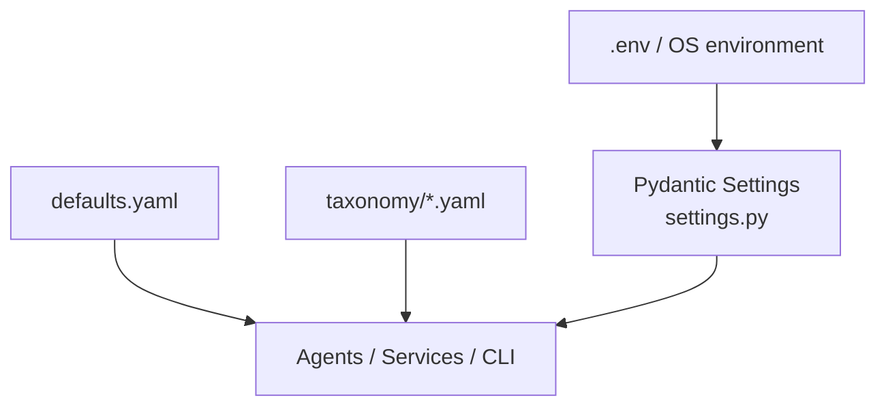

# Project Structure — Documentation AI Factory

Complete folder and file reference for v0.1.0 scaffolding.

## 1. Folder structure

```
documentation_ai_factory/
├── .env.example                 # Environment variable template
├── .gitignore                   # Ignores .env, runs/, output/, caches
├── README.md                    # Quickstart and overview
├── pyproject.toml               # Package definition, CLI entrypoint, tooling
├── requirements.txt             # Runtime dependencies
├── requirements-dev.txt         # Dev/test dependencies
│
├── docs/                        # Platform architecture documentation
│   └── PROJECT_STRUCTURE.md     # This file
│
├── runs/                        # Per-run artifacts (gitignored except .gitkeep)
│   └── .gitkeep
├── output/                      # Staging Markdown exports (gitignored)
│   └── .gitkeep
│
├── src/
│   └── doc_factory/             # Main Python package
│       ├── config/
│       ├── models/
│       ├── agents/
│       ├── services/
│       ├── tools/
│       ├── rendering/
│       ├── taxonomy/
│       └── prompts/
│
└── tests/
    ├── unit/
    ├── contract/
    └── fixtures/
```

## 2. File structure (complete)

```
documentation_ai_factory/
├── src/doc_factory/
│   ├── __init__.py
│   ├── main.py
│   │
│   ├── config/
│   │   ├── __init__.py
│   │   ├── settings.py
│   │   ├── logging.py
│   │   └── defaults.yaml
│   │
│   ├── models/
│   │   ├── __init__.py
│   │   ├── base.py
│   │   ├── topic.py
│   │   ├── research.py
│   │   ├── planning.py
│   │   ├── content.py
│   │   └── export.py
│   │
│   ├── agents/
│   │   ├── __init__.py
│   │   ├── root_workflow.py
│   │   ├── intake/
│   │   │   ├── __init__.py
│   │   │   ├── topic_intake.py
│   │   │   └── taxonomy_mapping.py
│   │   ├── research/
│   │   │   ├── __init__.py
│   │   │   ├── query_planner.py
│   │   │   ├── web_researcher.py
│   │   │   ├── source_aggregator.py
│   │   │   └── research_summarizer.py
│   │   ├── planning/
│   │   │   ├── __init__.py
│   │   │   ├── research_planner.py
│   │   │   ├── outline_architect.py
│   │   │   └── section_catalog.py
│   │   ├── generation/
│   │   │   ├── __init__.py
│   │   │   ├── section_writer.py
│   │   │   ├── architecture_writer.py
│   │   │   ├── scenario_writer.py
│   │   │   ├── implementation_writer.py
│   │   │   ├── benchmark_writer.py
│   │   │   ├── comparison_writer.py
│   │   │   ├── pros_cons_writer.py
│   │   │   ├── best_practices_writer.py
│   │   │   ├── poc_learning_writer.py
│   │   │   └── references_writer.py
│   │   └── export/
│   │       ├── __init__.py
│   │       ├── consistency_reviewer.py
│   │       ├── citation_validator.py
│   │       ├── template_compliance.py
│   │       └── markdown_exporter.py
│   │
│   ├── services/
│   │   ├── __init__.py
│   │   ├── gemini_client.py
│   │   ├── tavily_client.py
│   │   ├── run_repository.py
│   │   ├── artifact_store.py
│   │   ├── research_cache.py
│   │   └── docs_promoter.py
│   │
│   ├── tools/
│   │   ├── __init__.py
│   │   ├── tavily_search.py
│   │   ├── filesystem.py
│   │   └── taxonomy_lookup.py
│   │
│   ├── rendering/
│   │   ├── __init__.py
│   │   ├── front_matter.py
│   │   ├── markdown_renderer.py
│   │   ├── template_resolver.py
│   │   └── section_index.py
│   │
│   ├── taxonomy/
│   │   ├── __init__.py
│   │   ├── section_map.yaml
│   │   └── template_catalog.yaml
│   │
│   └── prompts/
│       ├── __init__.py
│       ├── registry.py
│       ├── intake/
│       │   └── topic_intake.txt
│       ├── research/
│       │   ├── query_planner.txt
│       │   └── research_summarizer.txt
│       ├── planning/
│       │   └── outline_architect.txt
│       └── generation/
│           └── section_writer.txt
│
└── tests/
    ├── __init__.py
    ├── conftest.py
    ├── unit/
    │   └── test_scaffolding.py
    ├── contract/
    │   └── test_topic_models.py
    └── fixtures/
        └── sample_tavily_response.json
```

## 3. Responsibilities of each file

### Root

| File | Responsibility |
| --- | --- |
| `README.md` | Quickstart, setup, CLI overview |
| `pyproject.toml` | Package metadata, `doc-factory` CLI script, pytest/ruff/mypy config |
| `requirements.txt` | Pinned runtime deps: google-adk, google-genai, tavily-python, pydantic, markdown libs |
| `requirements-dev.txt` | pytest, ruff, mypy |
| `.env.example` | Documented environment variable template |
| `.gitignore` | Exclude secrets, run artifacts, caches, venv |

### `src/doc_factory/`

| File | Responsibility |
| --- | --- |
| `__init__.py` | Package version |
| `main.py` | Click CLI: `new`, `run`, `resume`, `status`, `export`, `promote` (stubs) |

### `config/`

| File | Responsibility |
| --- | --- |
| `settings.py` | Pydantic Settings: API keys, paths, model names, pipeline limits |
| `logging.py` | Console and optional file logging from settings |
| `defaults.yaml` | Non-secret defaults: pipeline mode, research thresholds, export defaults |

### `models/`

| File | Responsibility |
| --- | --- |
| `base.py` | `ArtifactEnvelope` for versioned JSON artifacts |
| `topic.py` | `TopicRequest`, `TaxonomyMapping` |
| `research.py` | `ResearchQueryPlan`, `SourceCorpus`, `ResearchSummary`, etc. |
| `planning.py` | `ResearchPlan`, `DocumentationOutline`, `SectionCatalog` |
| `content.py` | `SectionDraft`, `DocumentationDraft`, `CitationRef` |
| `export.py` | `ReviewReport`, `ExportManifest`, `RunManifest`, `PhaseCheckpoint` |

### `agents/`

| File | Responsibility |
| --- | --- |
| `root_workflow.py` | ADK root Workflow wiring all phases |
| `intake/topic_intake.py` | Normalize user topic → `TopicRequest` |
| `intake/taxonomy_mapping.py` | Map topic → Architecture Space section |
| `research/query_planner.py` | Generate diversified Tavily queries |
| `research/web_researcher.py` | Execute Tavily search |
| `research/source_aggregator.py` | Dedupe and rank sources |
| `research/research_summarizer.py` | Synthesize `ResearchSummary` |
| `planning/research_planner.py` | Build `ResearchPlan` |
| `planning/outline_architect.py` | Define Markdown file tree |
| `planning/section_catalog.py` | Produce `SectionCatalog` |
| `generation/*.py` | Specialist writers per section type |
| `export/consistency_reviewer.py` | Cross-section QA |
| `export/citation_validator.py` | Citation coverage checks |
| `export/template_compliance.py` | Front matter and template validation |
| `export/markdown_exporter.py` | Write staging `.md` files |

### `services/`

| File | Responsibility |
| --- | --- |
| `gemini_client.py` | google-genai wrapper, flash/pro routing |
| `tavily_client.py` | tavily-python wrapper, rate limiting |
| `run_repository.py` | `run_manifest.json` CRUD, checkpoints |
| `artifact_store.py` | JSON artifact read/write under `runs/` |
| `research_cache.py` | TTL cache for Tavily responses |
| `docs_promoter.py` | Copy staging → `../docs/` after review |

### `tools/`

| File | Responsibility |
| --- | --- |
| `tavily_search.py` | ADK tool for web search |
| `filesystem.py` | ADK tool for bounded artifact I/O |
| `taxonomy_lookup.py` | ADK tool for section_map queries |

### `rendering/`

| File | Responsibility |
| --- | --- |
| `front_matter.py` | YAML front matter matching Architecture Space |
| `markdown_renderer.py` | `SectionDraft` → Markdown file |
| `template_resolver.py` | Load templates from `../tools/docs/templates/` |
| `section_index.py` | Hub README module tables |

### `taxonomy/`

| File | Responsibility |
| --- | --- |
| `section_map.yaml` | Keyword → docs section prefix routing |
| `template_catalog.yaml` | Template type → required headings |

### `prompts/`

| File | Responsibility |
| --- | --- |
| `registry.py` | Load Jinja2/text prompts by agent name |
| `*/*.txt` | Versioned prompt templates per agent |

### `tests/`

| File | Responsibility |
| --- | --- |
| `conftest.py` | Shared pytest fixtures |
| `unit/test_scaffolding.py` | Package import and path resolution smoke tests |
| `contract/test_topic_models.py` | Pydantic model validation tests |
| `fixtures/sample_tavily_response.json` | Sample API response for future tests |

## 4. Configuration strategy



| Layer | Source | Contents |
| --- | --- | --- |
| **Secrets** | `.env` (gitignored) | `GEMINI_API_KEY`, `TAVILY_API_KEY` |
| **Overrides** | `DOC_FACTORY_*` env vars | Paths, model names, limits, log level |
| **Defaults** | `config/defaults.yaml` | Pipeline mode, min sources, export status |
| **Taxonomy** | `taxonomy/*.yaml` | Topic routing, template requirements |
| **Runtime cache** | `runs/.cache/` | Tavily response cache (gitignored) |

Access pattern:

```python
from doc_factory.config.settings import get_settings

settings = get_settings()
runs_dir = settings.resolved_runs_dir
```

## 5. Environment variables

### Required (at pipeline runtime)

| Variable | Description |
| --- | --- |
| `GEMINI_API_KEY` | Google Gemini API key |
| `TAVILY_API_KEY` | Tavily Search API key |

### Optional — models

| Variable | Default | Description |
| --- | --- | --- |
| `DOC_FACTORY_GEMINI_MODEL_FLASH` | `gemini-2.0-flash` | Fast model for intake/research |
| `DOC_FACTORY_GEMINI_MODEL_PRO` | `gemini-2.5-pro` | Pro model for generation |

### Optional — paths

| Variable | Default | Description |
| --- | --- | --- |
| `DOC_FACTORY_REPO_ROOT` | Parent of factory dir | Architecture Space repo root |
| `DOC_FACTORY_PROJECT_ROOT` | Factory dir | Factory project root |
| `DOC_FACTORY_RUNS_DIR` | `{project}/runs` | Run artifacts |
| `DOC_FACTORY_OUTPUT_DIR` | `{project}/output` | Staging exports |

### Optional — pipeline

| Variable | Default | Description |
| --- | --- | --- |
| `DOC_FACTORY_TAVILY_MAX_RESULTS` | `5` | Results per Tavily query |
| `DOC_FACTORY_RESEARCH_CACHE_TTL_DAYS` | `7` | Cache TTL |
| `DOC_FACTORY_RESEARCH_QUERY_COUNT` | `10` | Queries per topic |
| `DOC_FACTORY_MAX_PARALLEL_SECTIONS` | `4` | Parallel generation limit |
| `DOC_FACTORY_MIN_SECTION_WORDS` | `400` | Minimum words per section |
| `DOC_FACTORY_LOG_LEVEL` | `INFO` | Logging level |
| `DOC_FACTORY_LOG_FILE` | _(none)_ | Optional log file path |

### ADK

| Variable | Description |
| --- | --- |
| `GOOGLE_API_KEY` | Alternative key used by ADK `adk web` (can mirror `GEMINI_API_KEY`) |

## 6. requirements.txt

See [`requirements.txt`](../requirements.txt). Key packages:

- `google-adk` — multi-agent orchestration
- `google-genai` — Gemini API client
- `tavily-python` — web research
- `pydantic`, `pydantic-settings` — data contracts and config
- `markdown-it-py`, `pyyaml`, `jinja2` — Markdown and templating
- `click`, `python-dotenv`, `tenacity`, `httpx` — CLI and utilities

## 7. Setup instructions

### Windows (PowerShell)

```powershell
cd C:\Users\swapn\Desktop\docs\Architecture_space\documentation_ai_factory

py -3.12 -m venv .venv
.\.venv\Scripts\Activate.ps1

pip install -U pip
pip install -r requirements-dev.txt
pip install -e .

Copy-Item .env.example .env
notepad .env   # Add GEMINI_API_KEY and TAVILY_API_KEY

doc-factory --help
pytest -v
```

### Verify paths resolve correctly

```powershell
python -c "from doc_factory.config.settings import get_settings; s=get_settings(); print(s.resolved_docs_root)"
```

Expected: path ending in `Architecture_space\docs`.

### Next implementation steps

1. Implement `RunRepository` and `ArtifactStore`
2. Wire Tavily tool and research phase agents
3. Define ADK `root_workflow.py`
4. Implement Markdown renderer and export agent
5. Pilot topic: Apache Kafka or Data Mesh
