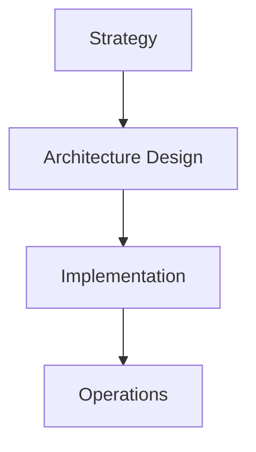

# [Section Title] Overview

## Context

Describe why this domain matters to the enterprise and how it connects to business strategy.

## Definition

Provide a clear, concise definition of the architecture domain or concept.

## Scope

| In scope | Out of scope |
| --- | --- |
| | |

## Key capabilities

- **Capability 1**: Description
- **Capability 2**: Description
- **Capability 3**: Description

## Architecture landscape

## Related topics

- [Related doc 1](path/to/doc.md)
- [Related doc 2](path/to/doc.md)

## Maturity snapshot

| Level | Characteristics |
| --- | --- |
| Initial | Ad hoc practices |
| Defined | Standard frameworks adopted |
| Optimized | Continuous improvement |

## Further reading

Link to subsections, reference architectures, and ADRs in this section.
