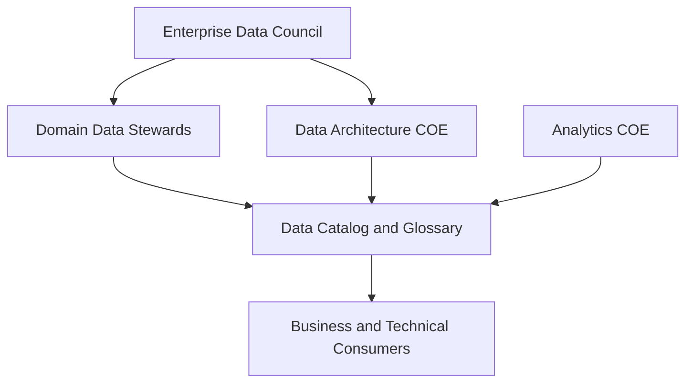

# Enterprise Semantics

## Context

Enterprise semantics is the organization-wide discipline of aligning business language, metric definitions, and logical data models so every domain, system, and analytics tool speaks the same meaning. This document defines the **governance operating model**—not the modeling artifacts themselves.

**Canonical modeling references:**

- [Business Glossary](../../../../04_Data_Modeling_Architecture/03_Modern/02_Semantic_Modeling/02_Business_Glossary.md)
- [Metrics Layer](../../../../04_Data_Modeling_Architecture/03_Modern/02_Semantic_Modeling/01_Metrics_Layer.md)
- [Semantic Layer](../../../../04_Data_Modeling_Architecture/03_Modern/02_Semantic_Modeling/03_Semantic_Layer.md)

## Definition

**Enterprise semantics** is the coordinated set of governance bodies, processes, standards, and tooling that ensure business terms, metrics, and semantic models are defined once, approved by accountable owners, and consumed consistently across the organization.

## Scope

| In scope | Out of scope |
| --- | --- |
| Governance operating model for semantics | Physical data pipeline governance |
| Roles, councils, and escalation paths | BI tool administration |
| Enterprise semantic maturity | Ontology engineering detail |
| Cross-domain alignment policy | Industry reference model licensing |

## Operating model

| Body | Responsibility |
| --- | --- |
| **Enterprise data council** | Approves semantic standards; resolves cross-domain disputes |
| **Domain data stewards** | Own glossary terms and metric certification for their domain |
| **Data architecture COE** | Maintains modeling standards; reviews semantic models |
| **Analytics COE** | Ensures BI platforms consume certified semantics only |
| **Data catalog team** | Operates glossary integration, discovery, and lineage |

## Semantic maturity levels

| Level | Characteristics |
| --- | --- |
| **1 — Ad hoc** | Definitions in spreadsheets; conflicting dashboard metrics |
| **2 — Defined** | Enterprise glossary and metrics catalog established |
| **3 — Governed** | Certification workflow; certified metrics in semantic layer |
| **4 — Productized** | Domains publish semantic data products with contracts |
| **5 — Optimized** | Automated drift detection; AI agents consume governed semantics |

See [Semantic Maturity](../Governance_Maturity/Semantic_Maturity.md).

## Key policies

1. **Single source of truth** — Terms and certified metrics are authored in the modeling pillar, not in BI tools.
2. **Business approval required** — No glossary term or certified metric reaches `approved` without business owner sign-off.
3. **Federated execution** — Domains own their semantics; enterprise sets standards and resolves conflicts.
4. **Breaking change control** — Metric and model changes follow [Semantic Governance Framework](Semantic_Governance_Framework.md) versioning rules.
5. **Catalog as front door** — All semantic artifacts are discoverable through the enterprise data catalog.

## Related topics

- [Semantic Governance Framework](Semantic_Governance_Framework.md) — detailed processes
- [Business Definition Governance](Business_Definition_Governance.md) — term approval workflow
- [Semantic Quality Framework](Semantic_Quality_Framework.md) — quality dimensions
- [Semantic Layer Strategy](../../../../06_Analytics_Architecture/01_BI_Architecture/Semantic_Layer_Architecture/Semantic_Layer_Strategy.md) — analytics rollout
- [Semantics Hub](../../../../_hubs/Semantics_Hub.md) — navigation index

## ADR reference

- [ADR 009 Semantic Governance Strategy](../../../../03_Architecture_Decision_Records/Governance_And_Metadata/ADR_009_Semantic_Governance_Strategy.md)
