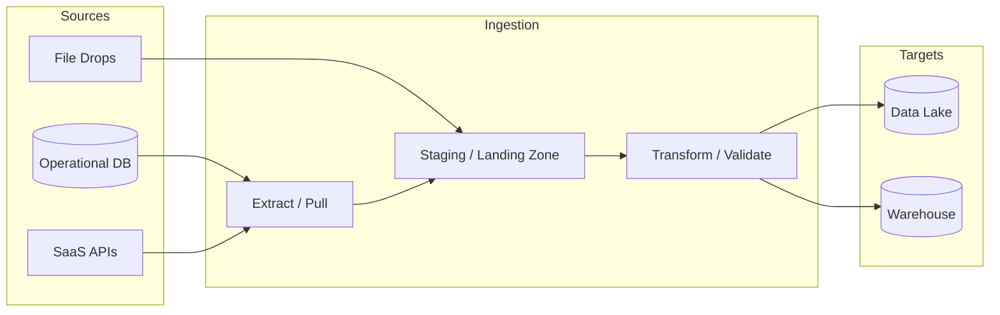

# Batch Ingestion

## Context

Enterprise data platforms depend on reliable movement of data from operational systems into analytics, reporting, and machine learning environments. Batch ingestion is the dominant pattern for scheduled, high-volume data movement where near-real-time delivery is not required. Architects use batch ingestion to land curated datasets on predictable schedules, control cost, and enforce governance before downstream consumption.

## Definition

Batch ingestion is the architectural practice of collecting, transferring, and loading data in discrete, scheduled intervals rather than continuously. Each batch run extracts or receives a bounded set of records—full snapshots, incremental deltas, or file drops—and processes them through a pipeline before delivering data to a target such as a lake, warehouse, or operational datastore.

## Scope

| In scope | Out of scope |
| --- | --- |
| Scheduled file drops, JDBC/ODBC extracts, API pagination pulls | Continuous stream processing and event-driven ingestion |
| Incremental and full-refresh load strategies | Real-time CDC with sub-second latency requirements |
| ETL and ELT batch pipelines | Application-level OLTP transaction design |
| Landing zones, staging layers, and batch orchestration | Downstream BI semantic modeling and consumption layer design |
| SaaS connector batch sync and bulk exports | Network and infrastructure provisioning |

## Key capabilities

- **Scheduled extraction**: Pull data from databases, APIs, and SaaS systems on cron-based or event-triggered schedules.
- **Bulk file ingestion**: Process CSV, Parquet, JSON, Avro, and similar formats from object storage or SFTP landing zones.
- **Incremental loading**: Apply change detection via timestamps, sequence numbers, or audit columns to minimize data movement.
- **Idempotent processing**: Ensure re-runs of failed batches do not corrupt target state through deduplication and merge semantics.
- **Orchestration and dependency management**: Coordinate multi-step pipelines with retry, backfill, and SLA monitoring.
- **Governance integration**: Apply schema validation, lineage capture, and access controls at ingestion boundaries.

## Architecture landscape

## Batch ingestion lifecycle

1. **Trigger**: A scheduler, file arrival event, or manual backfill initiates a batch run.
2. **Extract**: Source systems are queried or files are read within the batch window.
3. **Land**: Raw or lightly validated data is written to a staging or bronze layer.
4. **Transform**: Business rules, deduplication, and type conformance are applied.
5. **Load**: Curated data is merged into silver or gold target tables or datasets.
6. **Verify**: Row counts, schema checks, and reconciliation jobs confirm completeness.
7. **Publish**: Metadata, lineage, and data-quality metrics are registered for consumers.

## When to use batch ingestion

Batch ingestion is appropriate when:

- Business decisions tolerate latency measured in minutes to hours, not seconds.
- Source systems impose rate limits or maintenance windows that favor periodic bulk reads.
- Workloads benefit from amortized compute cost through scheduled cluster or serverless execution.
- Regulatory or operational processes require point-in-time snapshots for audit and reconciliation.

Consider streaming or near-real-time alternatives when downstream use cases require continuous freshness, operational alerting, or event-driven automation. See [Streaming vs Batch](../../../02_Streaming/01_Fundamentals/01_Overview/04_Streaming_vs_Batch.md) for mode selection guidance.

## Governance and operations

| Concern | Architectural response |
| --- | --- |
| Data freshness | Define SLA tiers per domain; monitor batch completion against expected cut-off times |
| Source impact | Use read replicas, off-peak windows, and incremental strategies to limit operational load |
| Failure recovery | Design idempotent stages; support partial reruns and configurable backfill windows |
| Schema drift | Enforce contract validation at landing; version schemas and quarantine non-conforming records |
| Security | Encrypt data in transit and at rest; apply least-privilege credentials per source and target |
| Cost | Right-size compute for batch windows; use lifecycle policies on staging storage |

## Maturity snapshot

| Level | Characteristics |
| --- | --- |
| Initial | Ad hoc scripts, manual file handling, inconsistent schedules |
| Defined | Standard orchestration, documented SLAs, staging layers, basic monitoring |
| Managed | Incremental patterns, automated reconciliation, lineage and quality gates |
| Optimized | FinOps-tuned batch windows, self-service backfill, cross-domain ingestion standards |

## Related topics

- [Batch Integration](02_Batch_Integration.md)
- [File Based Ingestion](../02_Ingestion_Patterns/01_File_Based_Ingestion.md)
- [Database Ingestion](../02_Ingestion_Patterns/02_Database_Ingestion.md)
- [SaaS Ingestion](../02_Ingestion_Patterns/03_SaaS_Ingestion.md)
- [API Ingestion](../02_Ingestion_Patterns/04_API_Ingestion.md)
- [Batch Data Platform](../03_Platform/01_Batch_Data_Platform.md)
- [ETL Architecture](../../04_Architecture_Patterns/01_ETL_ELT/01_ETL_Architecture.md)
- [Cloud Batch Reference Architecture](../../02_Cloud_Services/01_Overview/01_Cloud_Batch_Reference_Architecture.md)
- [02.01.01 Batch Ingestion hub](../../README.md)