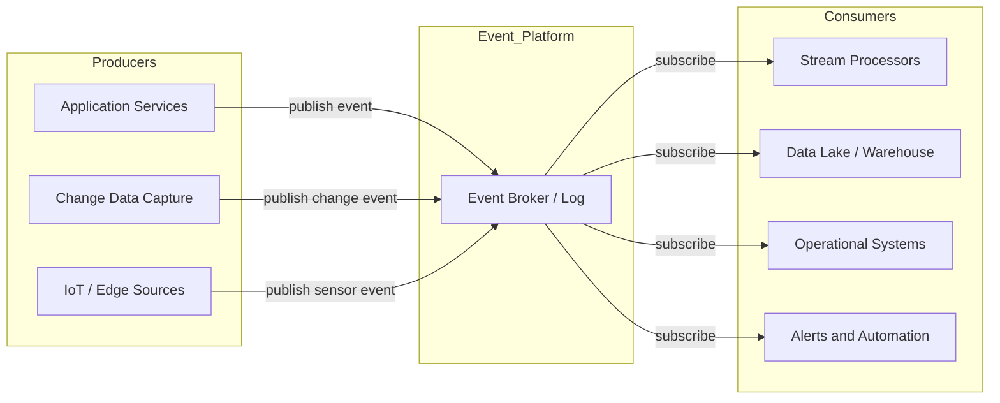
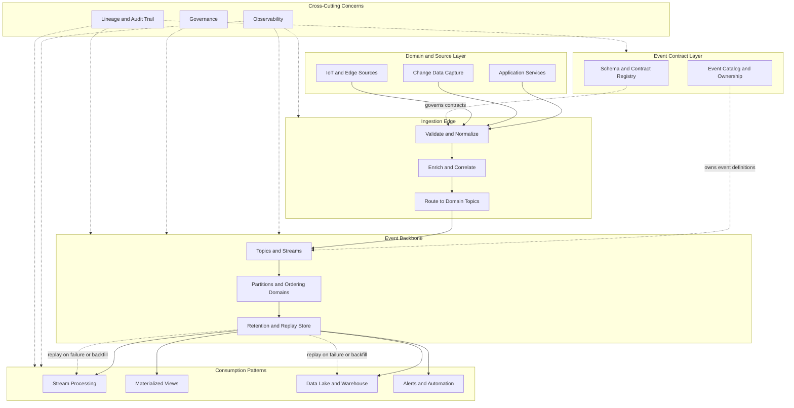
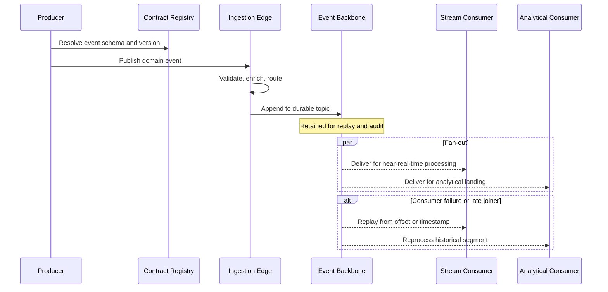

# What Is Event Driven Architecture

## Context

Enterprises generate business state changes continuously—orders placed, payments captured, inventory updated, sensor readings recorded. Batch-oriented, request–response integration cannot keep pace when downstream analytics, operational systems, and customer experiences must react in near real time. Event-driven architecture (EDA) treats these state changes as first-class **events** that are produced, propagated, and consumed asynchronously across bounded contexts.

Within data ingestion architecture, EDA establishes the foundational pattern for capturing domain activity at the source, transporting it reliably through event streams, and enabling real-time and near-real-time consumption by data platforms, applications, and decision systems.

## Definition

**Event-driven architecture** is an integration and system-design style in which components communicate by publishing and subscribing to **events**—immutable records of something that has already occurred—rather than by invoking one another synchronously. Producers emit events without knowledge of specific consumers; consumers react when relevant events arrive, enabling loose coupling, temporal decoupling, and independent scaling.

In the streaming ingestion domain, EDA manifests as **event producers** (applications, databases via change data capture, IoT gateways), **event brokers or log platforms** (Kafka, Pulsar, Kinesis, Pub/Sub), and **event consumers** (stream processors, materialized views, analytics pipelines, alerting services).

## Scope

| In scope | Out of scope |
| --- | --- |
| Event semantics, producers, consumers, and brokers in ingestion pipelines | Full application microservice design outside data boundaries |
| Event-first data capture, fan-out, and streaming integration | Batch-only ETL and scheduled file exchange |
| Relationship of EDA to stream processing and CDC | Detailed vendor evaluation and cost analysis |
| Enterprise governance, observability, and reliability expectations for event flows | Synchronous API gateway and REST integration patterns |

## Key capabilities

- **Loose coupling**: Producers and consumers evolve independently; new subscribers can join without changing upstream systems.
- **Temporal decoupling**: Events are durable and replayable, allowing consumers to process at their own rate or recover from failure.
- **Scalable fan-out**: A single event can drive analytics, operational dashboards, audit trails, and downstream integrations concurrently.
- **Near-real-time ingestion**: Domain activity reaches the data platform as it happens, reducing latency from minutes or hours to seconds or milliseconds.
- **Auditability and lineage**: Immutable event logs provide a chronological record of business activity for compliance, debugging, and reconstructing state.

## Architecture landscape

The summary view below orients readers to the core EDA pattern: producers publish to a durable event backbone; multiple consumers subscribe independently.

Typical flow: a **business event** occurs, a **producer** serializes and publishes it to an **event backbone**, and one or more **consumers** derive value—transforming, aggregating, persisting, or triggering action—without direct coupling to the origin system.

### Ingestion landscape (detailed)

The detailed landscape expands the summary model to show contract governance, ingestion edge processing, backbone internals, distinct consumption patterns, and cross-cutting operational concerns.

### Typical event lifecycle

The sequence view complements the topology by showing temporal ordering from emission through fan-out and replay.

### Architecture decisions

Each zone in the detailed landscape supports explicit enterprise decisions:

| Zone | Decision focus |
| --- | --- |
| **Contract layer** | Who owns event schema lifecycle and backward-compatibility rules? |
| **Ingestion edge** | What validation, enrichment, and routing occur before events enter the shared backbone? |
| **Event backbone** | Retention duration, partition key (ordering scope), and replay policy per event class |
| **Consumption patterns** | Which consumers require at-least-once versus effectively-once semantics and SLAs? |
| **Cross-cutting concerns** | Minimum observability, lineage, and governance signals before a topic is production-ready |

For pattern and technology detail, see [Event vs Message](03_Event_vs_Message.md), [Event Ingestion](04_Event_Ingestion.md), and [Streaming Ingestion](05_Streaming_Ingestion.md).

## Related topics

- [What Is Stream Processing](02_What_Is_Stream_Processing.md) — consuming and computing over continuous event streams
- [Event vs Message](03_Event_vs_Message.md) — distinguishing domain events from integration messages
- [Streaming vs Batch](04_Streaming_vs_Batch.md) — when event-driven ingestion supersedes batch extraction
- [Event Ingestion](04_Event_Ingestion.md) — patterns for landing events into the data platform
- [Streaming Ingestion](05_Streaming_Ingestion.md) — end-to-end streaming capture into the data platform
- [Streaming Integration](06_Streaming_Integration.md) — integrating streaming sources with downstream platforms
- [Event Driven Architecture](../03_Core_Concepts/01_Event_Driven_Architecture.md) — deeper evaluation of EDA patterns and technology options
- [Event First Strategy](../02_Strategy/01_Event_First_Strategy.md) — strategic adoption of event-native data capture

## Maturity snapshot

| Level | Characteristics |
| --- | --- |
| Initial | Point-to-point messaging; no shared event schema; limited observability |
| Defined | Central event platform; standard event contracts; governed topics and ownership |
| Optimized | Event catalog and lineage; replay and exactly-once semantics; FinOps and SLA governance for critical streams |

## Further reading

Continue with [Core Concepts](../03_Core_Concepts/01_Event_Driven_Architecture.md) for pattern evaluation, [CDC Overview](../04_CDC_Architecture/01_CDC_Overview.md) for database-sourced events, and [EventOps Framework](../05_EventOps/01_EventOps_Framework.md) for operational governance of streaming pipelines.