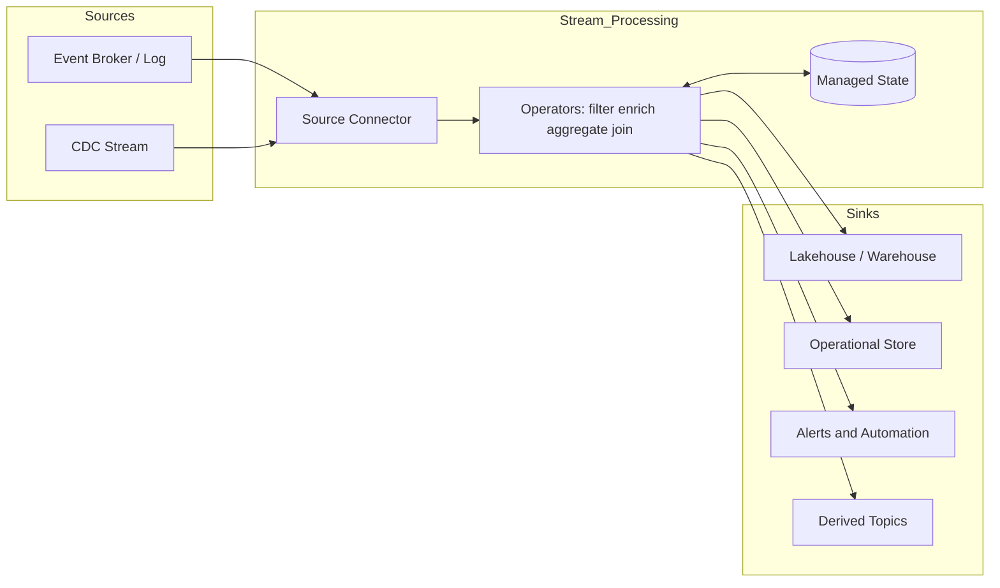

# What Is Stream Processing

## Context

Event-driven architecture ensures business activity reaches an event backbone in near real time, but transport alone does not deliver actionable insight. Downstream systems must **compute continuously**—filtering noise, enriching events, aggregating metrics, detecting anomalies, and materializing derived datasets—while data is still in motion. Stream processing closes this gap by applying transformation and analytics logic to unbounded, continuously arriving data rather than waiting for periodic batch loads.

Within data ingestion architecture, stream processing sits between the **event transport layer** (brokers, logs, managed messaging) and **consumption surfaces** (data lakehouse tables, operational stores, dashboards, and automated responses). It is the primary mechanism for turning raw event streams into governed, analytics-ready, and operational outputs at enterprise scale.

## Definition

**Stream processing** is a data-processing paradigm in which a runtime consumes an **unbounded sequence of events or records**, applies stateless or stateful transformations as each element arrives (or in micro-batches), and emits results to sinks with low end-to-end latency. Unlike batch jobs that operate on finite, scheduled datasets, stream processors treat data as a perpetual flow and manage correctness concerns such as ordering, time semantics, fault tolerance, and delivery guarantees in motion.

Common implementations include Apache Flink, Apache Spark Structured Streaming, Kafka Streams, ksqlDB, Google Cloud Dataflow, Azure Stream Analytics, and Amazon Managed Service for Apache Flink. These engines share a model of **sources → operators (map, filter, aggregate, join) → sinks**, executed on distributed workers with checkpointed state for recovery.

## Scope

| In scope | Out of scope |
| --- | --- |
| Continuous transformation, enrichment, and aggregation over event streams | One-off batch ETL and scheduled warehouse loads |
| Stateful and stateless operators, windowing, and stream–table joins in ingestion pipelines | Full OLAP cube design and BI semantic layer modeling |
| Processing semantics: event time, watermarks, delivery guarantees | Detailed broker or topic provisioning runbooks |
| Relationship of stream processing to EDA, CDC, and streaming ingestion | Low-level application microservice choreography outside data boundaries |

## Key capabilities

- **Low-latency transformation**: Records are processed within seconds or milliseconds of arrival, supporting operational dashboards, alerting, and near-real-time lakehouse updates.
- **Stateful computation**: Processors maintain keyed state—session buffers, running counts, deduplication windows—to support joins, aggregations, and pattern detection over historical context within the stream.
- **Time-aware processing**: Event-time windows, watermarks, and late-data policies ensure business-correct results despite network delay and out-of-order delivery.
- **Scalable parallelism**: Work is partitioned across operators and task slots, aligned with topic partitions, enabling horizontal scale as throughput grows.
- **Fault tolerance and replay**: Checkpointing and offset management allow recovery after failure and reprocessing from durable logs without re-extracting from source systems.
- **Stream–table duality**: Derived streams can be materialized as queryable tables while remaining connected to upstream change, unifying real-time and serving layers.

## Processing models

Enterprises encounter three common execution styles; selection affects latency, operational cost, and semantic guarantees:

| Model | Characteristics | Typical engines |
| --- | --- | --- |
| **True streaming** | Record-by-record pipelines with managed state and event-time semantics | Flink, Kafka Streams, Dataflow |
| **Micro-batch** | Short-period batch slices over a continuous source | Spark Structured Streaming |
| **Lightweight stream SQL** | Declarative queries over broker topics | ksqlDB, Flink SQL, Amazon MSF SQL |

Architecture teams should align model choice with SLA, state complexity, and existing platform skills rather than latency alone.

## Architecture landscape

Typical flow: events arrive from a **durable log or broker**, a **stream job** applies business logic with optional **managed state**, and **sinks** receive continuous updates. The same platform may serve both ingestion enrichment (landing curated streams to the lakehouse) and operational analytics (fraud scoring, inventory thresholds).

## Related topics

- [What Is Event Driven Architecture](01_What_Is_Event_Driven_Architecture.md) — event transport and integration patterns that feed stream processors
- [Event vs Message](03_Event_vs_Message.md) — payload semantics that influence processing design
- [Streaming vs Batch](04_Streaming_vs_Batch.md) — when continuous processing supersedes batch extraction
- [Streaming Ingestion](05_Streaming_Ingestion.md) — end-to-end capture of processed streams into the data platform
- [Event Time vs Processing Time](../03_Core_Concepts/02_Event_Time_vs_Processing_Time.md) — time domains governing window correctness
- [Stateful Processing](../03_Core_Concepts/04_Stateful_Processing.md) — state stores, checkpoints, and scaling stateful jobs
- [Exactly Once Semantics](../03_Core_Concepts/03_Exactly_Once_Semantics.md) — delivery guarantees across processors and sinks
- [Windowing Strategies](../../04_Architecture_Patterns/02_Stream_Processing_Patterns/01_Windowing_Strategies.md) — tumbling, sliding, and session window design

## Maturity snapshot

| Level | Characteristics |
| --- | --- |
| Initial | Ad hoc consumers; processing-time windows only; no centralized job governance |
| Defined | Standard stream-processing platform; event-time semantics; governed schemas and sink contracts |
| Optimized | Exactly-once end-to-end pipelines; FinOps and SLA tracking; replay and lineage integrated with EventOps |

## Further reading

Continue with [Streaming Reference Model](../02_Strategy/03_Streaming_Reference_Model.md) for target platform topology, [Flink Architecture](../../03_Open_Source/04_Apache_Flink/01_Flink_Architecture.md) for stateful engine design, [Stream Processor Selection Framework](../../06_Comparisons/05_Stream_Processor_Selection_Framework.md) for vendor evaluation, and [Stream Observability](../05_EventOps/02_Stream_Observability.md) for Day 2 operations.