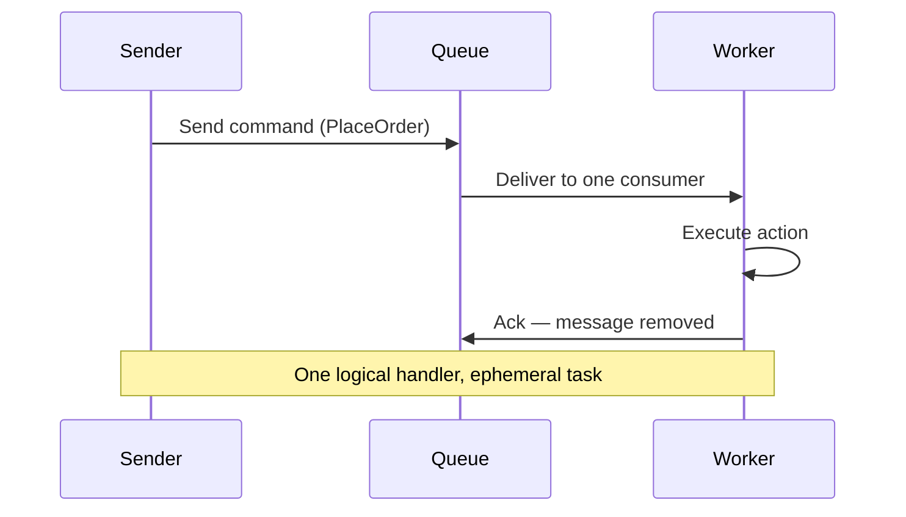
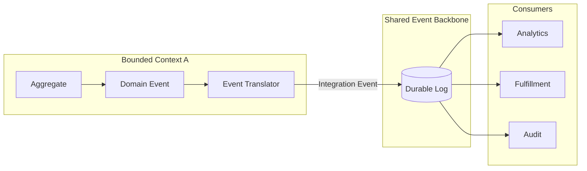

# Event vs Message

## Context

Teams building streaming ingestion pipelines routinely conflate **events** and **messages** because brokers label every payload a "message" while event-driven architecture (EDA) literature treats every publication as an "event." The confusion is costly: architects choose the wrong transport (ephemeral queue versus durable log), publish internal domain models across bounded contexts, or model imperative work as broadcast facts.

This document establishes a **three-layer taxonomy**—semantic intent, boundary contract, and transport model—that data and integration architects can apply in design reviews. It complements [What Is Event Driven Architecture](01_What_Is_Event_Driven_Architecture.md), which describes EDA topology; here the focus is **what travels on the wire and why**.

## Definition

An **event** is an immutable record that something **has already occurred** in the business or system domain. A **message** is the **transport envelope** used to deliver any payload—events, commands, or documents—across a queue, topic, or log. **Semantic type** (what the payload means) and **transport model** (how it is routed and retained) are independent decisions that must be made explicitly.

## Scope

| In scope                                                                | Out of scope                                 |
| ----------------------------------------------------------------------- | -------------------------------------------- |
| Semantic and transport distinctions for ingestion design                | Vendor feature matrices and broker selection |
| Domain versus integration boundary rules                                | Full event modeling workshops                |
| Command, event, and document message intent                             | Stream processing operator design            |
| Payload strategy trade-offs (notification, state transfer, claim check) | Orchestration saga implementation detail     |
| Queue versus log decision criteria                                      | Detailed delivery-guarantee mechanics        |

## Core concepts

### Events versus commands (semantic intent)

| Type                 | Tense / intent               | Addressing                            | Consumer obligation               | Failure ownership               |
| -------------------- | ---------------------------- | ------------------------------------- | --------------------------------- | ------------------------------- |
| **Command**          | Imperative — "do this"       | Point-to-point to one logical handler | Must attempt the requested action | Sender expects outcome or retry |
| **Event**            | Past tense — "this happened" | Publish to interested subscribers     | Optional reaction                 | Consumer's responsibility       |
| **Document message** | Data transfer                | Often point-to-point                  | Must consume payload              | Depends on SLA                  |

**Naming heuristic:** event names use past tense (`OrderPlaced`, `PaymentCaptured`); command names use imperative verbs (`PlaceOrder`, `CapturePayment`). Commands often **cause** events after successful execution—for example, `DeactivateUser` followed by `UserDeactivated`—but they serve different roles at different boundaries.

### Messages as transport envelopes

At the wire level, both events and commands are **messages**. Broker APIs may expose `sendMessage`, `publish`, or `produce`, but the distinction that governs architecture is **intent and routing**, not the API label. Always document the semantic type in event catalogs, schema registries, and design reviews to prevent transport terminology from obscuring meaning.

### Domain events versus integration events

| Type                  | Scope                    | Stability                         | Published to shared backbone?   |
| --------------------- | ------------------------ | --------------------------------- | ------------------------------- |
| **Domain event**      | Inside a bounded context | Evolves with internal refactoring | No — internal lifecycle only    |
| **Integration event** | Cross-context contract   | Versioned, long-lived, governed   | Yes — via translator and outbox |

**Decision rule:** never publish domain events directly to a shared event backbone. Translate at the bounded-context boundary through an **event translator** or **anti-corruption layer** so external consumers depend on a stable integration contract, not internal aggregate structure.

[CloudEvents](https://cloudevents.io/) provides an optional **wire envelope** at integration boundaries—standardizing metadata such as `id`, `source`, and `type`—but does not replace domain modeling or integration schema design.

### Event payload strategies

| Strategy                         | Payload                           | Coupling                       | Best when                                                      |
| -------------------------------- | --------------------------------- | ------------------------------ | -------------------------------------------------------------- |
| **Event notification**           | Identifier plus minimal metadata  | Consumer queries source system | Privacy constraints, freshness requirements, small fan-out     |
| **Event-carried state transfer** | Full or partial state snapshot    | Autonomous consumers           | High fan-out, analytics landing, resilience to source downtime |
| **Claim check**                  | Reference to blob or object store | Medium                         | Large attachments, media, or documents                         |

Explicit payload strategy per event type prevents under-sharing (API chattiness, N+1 lookups) and over-sharing (stale replicas, excessive coupling).

## How it works

### Command flow (work queue)

Commands distribute **work** to a single logical handler. The message is typically deleted after acknowledgment.

### Event flow with boundary translation

Events distribute **facts** to multiple independent consumers via a durable log. Domain events remain internal until translated.

Integration events should publish only after the originating transaction commits. The **transactional outbox** pattern writes the integration event to an outbox table in the same database transaction as the business write, then a relay process publishes to the backbone—avoiding dual-write inconsistency.

### Transport model comparison

| Model                  | Primary goal                      | Retention                 | Multi-consumer                   | Replay          |
| ---------------------- | --------------------------------- | ------------------------- | -------------------------------- | --------------- |
| **Message queue**      | Distribute work (task completion) | Ephemeral — delete on ack | Competing consumers on one queue | Limited or none |
| **Event log / stream** | Distribute facts (state changes)  | Durable append-only log   | Independent consumer groups      | First-class     |

The same broker product can implement both patterns depending on subscription mode (competing versus fan-out consumers). **Pattern choice precedes product choice.**

## When to use

### Decision framework

| Question                        | Lean toward **queue / command** | Lean toward **log / event**               |
| ------------------------------- | ------------------------------- | ----------------------------------------- |
| What is being communicated?     | A task someone must perform     | A fact about state that already changed   |
| How many independent consumers? | One logical processor           | Multiple, possibly added later            |
| Is history required?            | No — fire-and-forget work       | Yes — audit, replay, backfill, ML retrain |
| Coupling tolerance              | Sender cares about completion   | Sender must not know subscribers          |
| Ordering scope                  | Per-task FIFO sufficient        | Per-key or global ordering over time      |
| Typical ingestion role          | Async job handoff at the edge   | Primary data-ingestion backbone           |

### Composite scenarios

| Scenario                                   | Semantic type     | Transport    | Rationale                                            |
| ------------------------------------------ | ----------------- | ------------ | ---------------------------------------------------- |
| Process refund asynchronously              | Command           | Queue        | Single handler; task completion matters              |
| Order placed → analytics, shipping, fraud  | Event             | Log          | Multi-consumer fan-out; replay for new services      |
| CDC row change                             | Event (technical) | Log          | Fact about database state; retained for pipelines    |
| Send email notification                    | Command or event  | Either       | Event if broadcast; command if single mailer service |
| Cross-team contract after aggregate commit | Integration event | Log + outbox | Stable schema; decoupled evolution                   |

## Challenges

- **Terminology overload**: "Message" on the wire does not imply message-driven task semantics. Mitigation: state semantic type explicitly in catalogs and reviews.
- **Event log as task queue**: Using a durable log with competing consumers for imperative work causes replay storms and semantic confusion. Mitigation: separate command queues from fact streams.
- **Leaky domain events**: Publishing internal aggregate models couples external consumers to refactoring. Mitigation: mandatory translator and schema registry for integration contracts.
- **Fat versus thin payload drift**: Under-sharing forces chattiness; over-sharing creates stale replicas. Mitigation: document payload strategy per event type.
- **Dual writes**: Publishing before database commit risks inconsistency. Mitigation: transactional outbox with at-least-once relay and idempotent consumers.

## Expert concepts

- **Commands cause events**: Model both at appropriate boundaries—command at the integration edge, domain event internally, integration event at publication.
- **CDC events are technical integration events**: Change-data-capture payloads reflect storage mechanics, not ubiquitous business language; govern them with separate schema lifecycle and ownership.
- **Idempotency differs by type**: Commands require single processing semantics; events require idempotent **reaction** because replay and at-least-once delivery are normal.
- **Hybrid architectures are common**: Operational commands on queues and analytical facts on logs often coexist; the taxonomy clarifies which path each flow uses.

## Related topics

- [What Is Event Driven Architecture](01_What_Is_Event_Driven_Architecture.md) — EDA topology, producers, consumers, and event backbone
- [What Is Stream Processing](02_What_Is_Stream_Processing.md) — continuous computation over event streams
- [Event Ingestion](04_Event_Ingestion.md) — patterns for landing events into the data platform
- [Streaming Ingestion](05_Streaming_Ingestion.md) — end-to-end streaming capture
- [Exactly Once Semantics](../03_Core_Concepts/03_Exactly_Once_Semantics.md) — delivery guarantees across processors and sinks
- [Choreography vs Orchestration](../../04_Architecture_Patterns/01_Event_Driven_Patterns/01_Choreography_vs_Orchestration.md) — coordinating reactions to events across services
- [Domain Events](../../08_Integration_Patterns/01_Domain_Events.md) — modeling events within bounded contexts
- [Event Modeling](../../08_Integration_Patterns/02_Event_Modeling.md) — designing event-centric integration contracts
- [Streaming Fundamentals Questions](../../07_Interview_Questions/01_Streaming_Fundamentals_Questions.md) — interview scenarios including queue versus log trade-offs