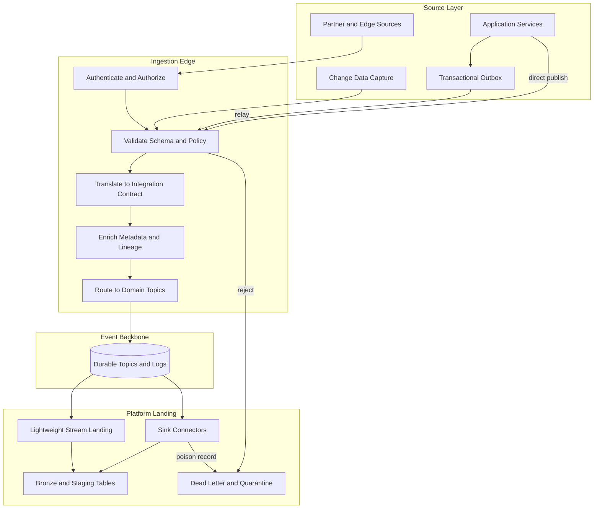
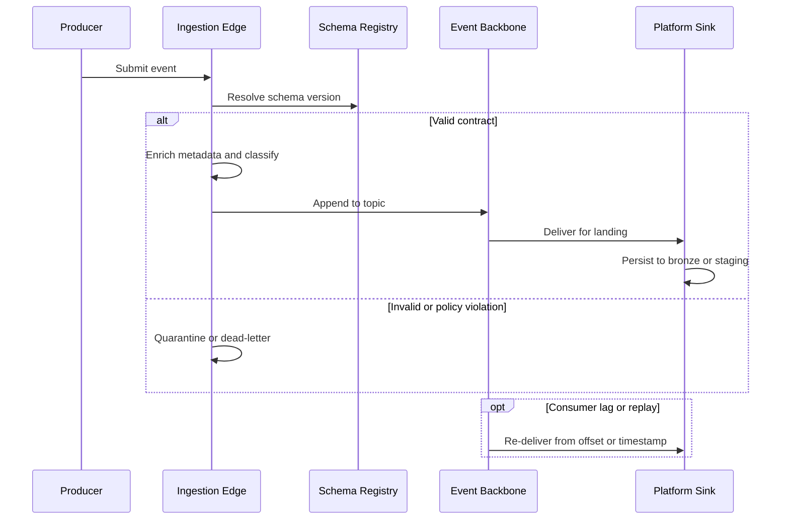

# Event Ingestion

## Context

Event-driven architecture establishes a durable event backbone, but the data platform still requires explicit **ingestion patterns** to accept, validate, and persist events at enterprise scale. Producers emit domain and integration events from applications, change-data-capture relays, IoT gateways, and partner systems; without governed ingestion, teams accumulate inconsistent schemas, silent data loss, and operational blind spots at the boundary between domain systems and analytics platforms.
Within streaming ingestion architecture, **event ingestion** addresses how events cross from source systems through the **ingestion edge** into the shared backbone and onward to **data platform sinks**—lakehouse bronze tables, warehouse staging zones, search indexes, and operational materialized views. It complements [What Is Event Driven Architecture](01_What_Is_Event_Driven_Architecture.md), which describes topology, and precedes [Streaming Ingestion](05_Streaming_Ingestion.md), which covers end-to-end pipeline orchestration.

## Definition

**Event ingestion** is the set of architectural patterns, edge services, and connector mechanisms that **capture, validate, normalize, route, and land events** from producers into the data platform with governed contracts, observable delivery semantics, and recoverability. Ingestion establishes the contract boundary where external or cross-context events become **durable, cataloged inputs** to downstream stream processing and storage—not merely messages in transit.

Successful event ingestion treats each event as an **immutable fact** (see [Event vs Message](03_Event_vs_Message.md)), applies schema and policy checks before shared publication, and selects landing semantics (append, upsert, claim-check reference) appropriate to the target sink.

## Scope

| In scope | Out of scope |
| --- | --- |
| Ingestion edge validation, enrichment, routing, and landing patterns | Full stream-processing operator design and windowing logic |
| Producer-side capture: outbox relay, CDC, gateway publish, connector sources | Application microservice choreography outside data boundaries |
| Contract enforcement, idempotency, and delivery semantics at ingestion boundaries | Detailed broker cluster sizing and topic provisioning runbooks |
| Bronze and staging landing into lakehouse, warehouse, and operational stores | Batch-only file exchange and scheduled ETL extraction |
| Relationship to EDA, CDC, and streaming integration | Vendor cost models and product selection matrices |

## Key capabilities

- **Contract-governed admission**: Events are validated against registered schemas and compatibility rules before entering shared topics or sinks.
- **Boundary translation**: Domain events are converted to stable integration contracts at the ingestion edge, decoupling internal models from platform consumers.
- **Durable capture**: Transactional outbox, CDC relays, and append-only logs ensure events survive producer or network failure.
- **Normalized landing**: Events land in bronze or staging layers with consistent metadata—event time, source, lineage, and classification—for downstream silver and gold processing.
- **Recoverable delivery**: Offsets, replay, and dead-letter handling allow backfill, late joiners, and failure isolation without re-extracting from source systems.
- **Observable ingestion SLAs**: Lag, error rate, schema drift, and volume metrics are tracked per event type and owning team.

## Ingestion patterns

Enterprises typically implement one or more of the following patterns at the ingestion boundary. Pattern choice depends on source consistency requirements, fan-out needs, and whether the event originates inside or outside a bounded context.

| Pattern | Source | Mechanism | Best when |
| --- | --- | --- | --- |
| **Direct publish** | Application service | Producer validates and publishes to backbone topic | Low-latency domain events; mature schema registry; trusted producers |
| **Transactional outbox relay** | Application database | Same-transaction outbox write; CDC or polling relay to broker | Strong consistency between business write and event emission |
| **CDC ingestion** | Operational database | Log-based or trigger-based change capture to technical event stream | Analytics and replication driven by storage state changes |
| **Ingestion gateway** | Heterogeneous producers | Central edge service: authenticate, validate, enrich, route | Many teams or partners; policy enforcement before shared backbone |
| **Connector landing** | Backbone or external stream | Managed or open-source sink connectors to lakehouse / warehouse | Standardized bronze landing without custom stream jobs |
| **Claim-check landing** | Large payloads | Store blob in object storage; ingest lightweight reference event | Media, documents, or payloads exceeding broker size limits |

**Decision rule:** never land raw domain models from internal aggregates directly into shared platform topics. Translate at the ingestion edge to a versioned **integration event** with documented payload strategy (notification, state transfer, or claim check) as defined in [Event vs Message](03_Event_vs_Message.md).

## Architecture landscape

The diagram below shows the canonical event ingestion path from domain sources through the ingestion edge and backbone to platform sinks.

Typical flow: a **business or technical event** is captured at the source, passes through **ingestion edge** processing under contract governance, is appended to a **durable topic**, and is **landed** continuously into platform storage via connectors or stream jobs. Failures route to **dead-letter or quarantine** paths for replay after remediation.

### Event lifecycle at the ingestion boundary

## Design decisions

Architecture teams should resolve the following decisions explicitly for each event class before production ingestion:

| Decision area | Questions |
| --- | --- |
| **Capture mechanism** | Direct publish, outbox relay, or CDC—which guarantees consistency with the source of truth? |
| **Payload strategy** | Notification, state transfer, or claim check—what must consumers derive without callback to source? |
| **Ordering scope** | Partition key and per-key ordering requirements for downstream deduplication and upserts |
| **Delivery semantics** | At-least-once with idempotent sinks, or effectively-once end-to-end across edge and landing job |
| **Landing model** | Append-only bronze, keyed upsert to silver staging, or dual write to backbone and lake |
| **Retention alignment** | Broker retention versus lakehouse time travel and regulatory hold requirements |
| **Failure handling** | Dead-letter topic thresholds, quarantine workflow, and replay authorization |
| **Governance signals** | Minimum catalog metadata, ownership, and observability before topic is production-ready |

For outbox and CDC capture detail, see [Outbox Pattern](../04_CDC_Architecture/03_Outbox_Pattern.md) and [CDC Ingestion](../04_CDC_Architecture/08_CDC_Ingestion.md). For contract lifecycle, see [Event Contracts](../../08_Integration_Patterns/04_Event_Contracts.md).

## Challenges

- **Dual writes without outbox**: Publishing to a broker before database commit causes lost or phantom events. Mitigation: transactional outbox with at-least-once relay and idempotent consumers.
- **Schema drift at the edge**: Undetected incompatible changes break landing jobs. Mitigation: schema registry with compatibility modes and CI contract tests.
- **Fat payloads on the backbone**: Large attachments inflate cost and breach broker limits. Mitigation: claim-check pattern with reference events and governed object-store paths.
- **Ordering versus parallelism**: Global ordering limits throughput; loose ordering complicates upsert logic. Mitigation: document partition key as the ordering domain per event type.
- **Poison messages**: Repeatedly failing records block pipelines. Mitigation: dead-letter routing, quarantine store, and operational replay runbooks integrated with EventOps.
- **Silent landing gaps**: Connectors succeed at the broker but fail at the sink without alerting. Mitigation: end-to-end lag and row-count reconciliation between backbone offsets and bronze tables.

## Related topics

- [What Is Event Driven Architecture](01_What_Is_Event_Driven_Architecture.md) — EDA topology, producers, consumers, and event backbone
- [What Is Stream Processing](02_What_Is_Stream_Processing.md) — continuous transformation after events enter the platform
- [Event vs Message](03_Event_vs_Message.md) — semantic distinctions governing ingestion design
- [Streaming vs Batch](04_Streaming_vs_Batch.md) — when event ingestion supersedes batch extraction
- [Streaming Ingestion](05_Streaming_Ingestion.md) — end-to-end orchestration of streaming capture into the data platform
- [Streaming Integration](06_Streaming_Integration.md) — integrating streaming sources with downstream platforms
- [Streaming to Lakehouse](../../04_Architecture_Patterns/05_Reference_Architectures/03_Streaming_To_Lakehouse.md) — medallion alignment for stream landing
- [Event First Strategy](../02_Strategy/01_Event_First_Strategy.md) — strategic adoption of event-native data capture
- [EventOps Framework](../05_EventOps/01_EventOps_Framework.md) — operational governance of streaming pipelines

## Maturity snapshot

| Level | Characteristics |
| --- | --- |
| Initial | Ad hoc producer publishes; no central validation; manual landing scripts; limited dead-letter handling |
| Defined | Ingestion gateway or standard connectors; schema registry enforced; bronze landing with ownership and lag dashboards |
| Optimized | End-to-end lineage from source to bronze; automated replay and quarantine workflows; FinOps and SLA governance per critical event class |

## Further reading

Continue with [CDC Overview](../04_CDC_Architecture/01_CDC_Overview.md) for database-sourced events, [Streaming to Lakehouse](../../04_Architecture_Patterns/05_Reference_Architectures/03_Streaming_To_Lakehouse.md) for medallion landing patterns, and [Stream Observability](../05_EventOps/02_Stream_Observability.md) for Day 2 ingestion operations.