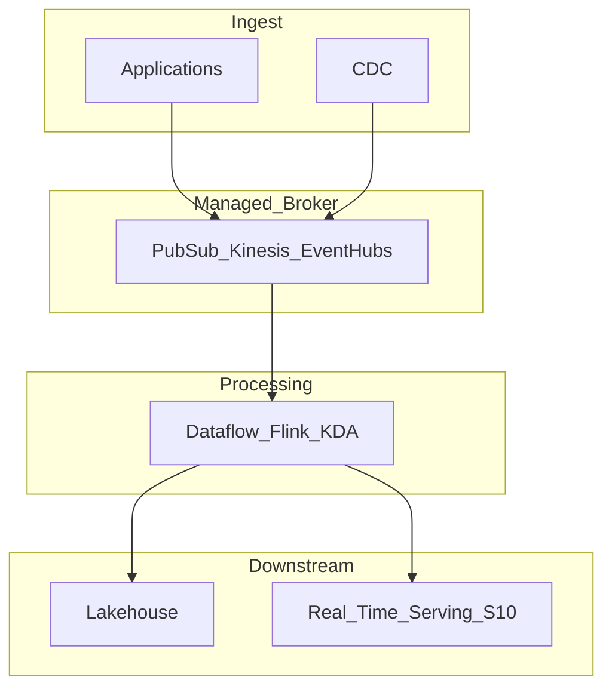

# Cloud Streaming Reference Architecture

## Purpose

Standard hyperscaler mapping for enterprise event transport and stream processing — transport in managed brokers, compute in managed stream processors, governance via cloud IAM and private networking.

## Hyperscaler matrix

| Capability | GCP | AWS | Azure |
| --- | --- | --- | --- |
| Event ingest | Pub/Sub | Kinesis Data Streams / MSK | Event Hubs |
| Stream processing | Dataflow (Beam) | Managed Flink / Kinesis Analytics | Stream Analytics / Flink on AKS |
| Schema registry | Pub/Sub schemas / Glue | Glue Schema Registry | Schema Registry (Event Hubs) |
| CDC | Datastream | DMS | ADF / SQL triggers |

## Reference diagram

## Design principles

1. **Private connectivity** — VPC/VNet peering, no public broker endpoints in production.
2. **IAM least privilege** — per-topic/service account or role boundaries.
3. **Multi-AZ by default** — availability over single-zone cost savings.
4. **FinOps** — partition keys and retention drive cost; link to section 04.06 for chargeback.

## Related

- [Pub/Sub Architecture](../02_GCP/02.01.02.02.02.01_Pub_Sub_Architecture.md)
- [Pub/Sub Learning Guide](../02_GCP/04_Pub_Sub_Learning_Guide/README.md)
- [Dataflow Architecture](../02_GCP/02.01.02.02.02.02_Dataflow_Architecture.md)
- [Dataflow Learning Guide](../02_GCP/05_Dataflow_Learning_Guide/README.md)
- [MSK Architecture](../03_AWS/01_MSK_Architecture.md)
- [Event Hubs Architecture](../04_Azure/01_Event_Hubs_Architecture.md)
- [GCP Pub/Sub POC](../02_GCP/02.01.02.02.02.03_GCP_PubSub_POC.md)
