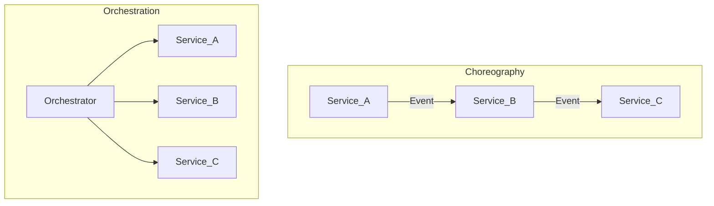

# Choreography vs Orchestration

## Definitions

| Style | Control | Coupling | Visibility |
| --- | --- | --- | --- |
| **Choreography** | Each service reacts to events; no central controller | Low; implicit workflow | Harder end-to-end trace |
| **Orchestration** | Central coordinator issues commands/steps | Higher; explicit workflow | Clear process state |

## When to use choreography

- Simple event chains (OrderPlaced → InventoryReserved → PaymentCaptured).
- Teams own full vertical slices with strong domain events.
- Scale-out and failure isolation matter more than global visibility.

## When to use orchestration

- Long-running business processes with compensations ([Saga Pattern](03_Integration_Patterns/02_Saga_Pattern.md)).
- Human tasks, timers, and conditional branching.
- Regulatory audit requiring explicit process instance state.

## Hybrid enterprise pattern

Choreography for **domain events** inside bounded contexts; orchestration (Temporal, Camunda, Step Functions) for **cross-domain sagas** with SLAs.

## Related

- [Saga Pattern](../03_Integration_Patterns/02_Saga_Pattern.md)
- [Event Driven Microservices](../../08_Integration_Patterns/08_Event_Driven_Microservices.md)
