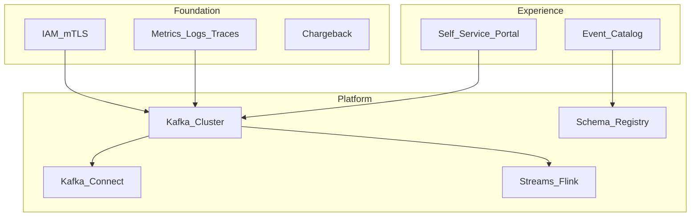

# Enterprise Kafka Platform

## Vision

A governed, multi-tenant Kafka platform providing durable event streaming for all domains — with standardized security, schema management, and self-service topic provisioning.

## Platform layers

## Multi-tenancy patterns

| Pattern | Isolation | Cost |
| --- | --- | --- |
| Topic prefix per domain | Logical | Lowest |
| Dedicated cluster per domain | Physical | Highest |
| Shared cluster + ACL quotas | Balanced | **Recommended default** |

## Non-functional targets

- **Availability** — 99.95%+ multi-AZ, RF=3, min ISR=2.
- **Durability** — `acks=all`, replication monitoring.
- **Latency** — p99 produce < 10ms intra-region for critical paths.
- **Governance** — mandatory schema registration, retention policies, PII tagging.

## Related

- [Kafka Architecture](../../03_Open_Source/02_Apache_Kafka/01_Kafka_Architecture.md)
- [Event Catalog](../../08_Integration_Patterns/06_Event_Catalog.md)
- [Stream Observability](../../01_Fundamentals/05_EventOps/02_Stream_Observability.md)
