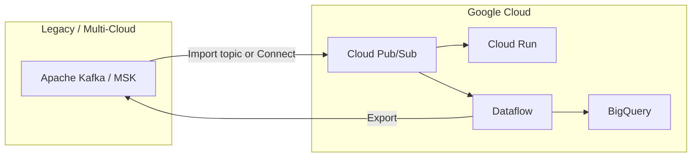

# Google Cloud Pub/Sub vs Apache Kafka

## Summary

**Google Cloud Pub/Sub** is a fully managed, serverless messaging service optimized for decoupled microservices, cloud-native fan-out, and minimal operations on GCP. **Apache Kafka** is a self-managed (or vendor-managed) distributed **event log** optimized for high-throughput replay, stream processing, and portable multi-cloud streaming platforms.

They solve overlapping problems with different trade-offs: Pub/Sub trades partition-level control and Kafka protocol compatibility for elastic scale and zero broker ops; Kafka trades operational complexity for fine-grained tuning, ecosystem depth, and replay semantics at petabyte scale.

| Lens | Google Cloud Pub/Sub | Apache Kafka |
| --- | --- | --- |
| Primary mental model | Managed message bus (pub/sub) | Durable, partitioned commit log |
| Best fit | GCP-native event integration, serverless consumers | Enterprise event backbone, stream processing, CDC |
| Ops burden | Low (no brokers/partitions to size) | Medium–high (or shift to MSK/Confluent) |
| Portability | GCP-centric; export via Dataflow/Connect patterns | High (de facto industry standard) |

---

## Architecture and deployment

| Criterion | Google Cloud Pub/Sub | Apache Kafka |
| --- | --- | --- |
| Service model | Fully managed SaaS; no brokers to provision | Self-hosted cluster or managed (MSK, Confluent, Aiven, Redpanda) |
| Control plane | GCP APIs (Console, gcloud, Terraform) | Cluster admin APIs, CLI, Operator/Helm, vendor consoles |
| Data plane | Google-operated elastic backend | Broker processes store topic partitions on disk |
| Capacity planning | Quota-based; scales elastically within project limits | Partition count, broker count, disk IOPS, network — explicit sizing |
| Partitioning model | No user-visible partitions; parallelism via ordering keys + subscriber scale | User-defined partitions per topic; unit of parallelism and ordering |
| Storage location | Opaque; regional delivery semantics | Explicit per-broker log segments on attached storage |
| High availability | Built-in multi-zone within region | Replication factor + `min.insync.replicas`; rack awareness |
| Cluster metadata | Fully managed | ZooKeeper (legacy) or KRaft (preferred for new clusters) |
| Upgrade / patching | Google-managed | Customer or managed-service provider |
| Multi-tenancy | Project + IAM isolation; shared multi-tenant service | Cluster-level isolation; stronger with Confluent/Pulsar-style tenancy |

---

## Data model and messaging patterns

| Criterion | Google Cloud Pub/Sub | Apache Kafka |
| --- | --- | --- |
| Publish target | **Topic** | **Topic** |
| Consume binding | **Subscription** (one per consumer app / sink) | **Consumer group** (competing consumers) or independent consumers |
| Fan-out | Native: N subscriptions on one topic, each gets all messages | Native: N consumer groups read same topic independently |
| Competing consumers | One subscription → each message to one subscriber instance | Consumer group → each partition assigned to one consumer in group |
| Message identity | `messageId`, `publishTime` | Offset + timestamp; optional headers |
| Payload limit | 10 MB per message | Default 1 MB (`max.message.bytes` configurable) |
| Message attributes | Up to 100 key/value attributes; subscription filters | Headers (unlimited count, size bounded by message max) |
| Key / routing | Optional `orderingKey` for FIFO per key | Record **key** drives partition assignment |
| Log compaction | Not supported (retention-based) | Supported for keyed changelog topics |
| Dead-letter handling | Native DLQ topic per subscription | Manual pattern (separate topic) or Connect error handling |
| Push delivery | Native HTTPS push to endpoints | Not native; use Kafka REST Proxy or stream processors |
| Pull delivery | Pull / StreamingPull (recommended at scale) | Poll-based consumer API |

---

## Delivery semantics and ordering

| Criterion | Google Cloud Pub/Sub | Apache Kafka |
| --- | --- | --- |
| Default guarantee | **At-least-once** | **At-least-once** (consumer commits offset after processing) |
| Exactly-once | Subscription flag: deduped delivery **within region** under normal operation | Transactions API + idempotent producer (EOS for consume-process-produce) |
| End-to-end exactly-once | Requires idempotent sinks; not automatic across services | Achievable within Kafka Streams / Flink with EOS; cross-system still needs design |
| Ordering scope | Per **ordering key** when ordering enabled on subscription | Per **partition** (total order within partition only) |
| Cross-partition order | Not guaranteed | Not guaranteed |
| Ack model | Explicit **ack** / **nack** with configurable ack deadline | Offset commit (auto or manual) |
| Redelivery trigger | No ack before deadline → redelivery | Consumer crash before commit → replay from last committed offset |
| Duplicate risk | Yes (at-least-once); reduced with exactly-once flag | Yes (at-least-once); mitigated with idempotent consumers |
| Poison message | DLQ topic + max delivery attempts | Custom retry/DLQ patterns |

---

## Retention, replay, and event sourcing

| Criterion | Google Cloud Pub/Sub | Apache Kafka |
| --- | --- | --- |
| Retention model | Topic message retention (up to **31 days**); subscription retention for unacked/acked | Time- and/or size-based per topic; unbounded with tiered storage |
| Replay mechanism | **Seek** (timestamp/snapshot) on pull subscriptions; snapshots for point-in-time | Reset consumer offset; replay from any retained offset |
| Event sourcing fit | Limited by retention window; export to GCS/BigQuery for long archive | Strong: indefinite retention, compaction for entity state |
| Immutable log | Messages immutable once published | Append-only partition log |
| Multiple reads of same offset | New subscription or seek replay within retention | Any consumer group can re-read while data retained |
| Tiered / cold storage | Export subscriptions (BigQuery, Cloud Storage) | Tiered storage (Confluent), S3/GCS via connectors |
| CDC / changelog | Via Dataflow or downstream stores | First-class with compacted topics + Debezium/Kafka Connect |

---

## Performance and scale

| Criterion | Google Cloud Pub/Sub | Apache Kafka |
| --- | --- | --- |
| Throughput | Elastic; quota-based (e.g., publish/subscribe MiB/s per region) | Scales with partitions × broker hardware; benchmark-driven sizing |
| Latency (typical) | Low tens of ms (managed path, push adds HTTP RTT) | Sub-ms to low ms within cluster; depends on `linger.ms`, batching |
| Max message rate | High at cloud scale; batching recommended | Very high with tuned producers (100k+ msg/s per partition possible) |
| Hot-spot risk | Single ordering key can serialize throughput | Single hot partition key can bottleneck partition |
| Backpressure | Subscription backlog metrics; push endpoint slowness causes backlog | Consumer lag per partition; `max.poll.interval.ms` limits |
| Batching | Strong FinOps incentive: **1 KB minimum per publish/pull request** | Producer batching for throughput (`batch.size`, `linger.ms`) |

---

## Stream processing and ecosystem

| Criterion | Google Cloud Pub/Sub | Apache Kafka |
| --- | --- | --- |
| Native stream processing | None; use **Dataflow**, Cloud Functions, Cloud Run | **Kafka Streams**, ksqlDB; Flink/Spark consume Kafka natively |
| Connectors | BigQuery / GCS subscriptions; import from MSK, Kinesis, Confluent, Event Hubs | **Kafka Connect** ecosystem (hundreds of connectors) |
| Schema registry | **Pub/Sub Schema** (Avro, Protobuf, JSON) | Confluent Schema Registry, Apicurio, AWS Glue |
| Analytics integration | Dataflow, BigQuery, Looker stack on GCP | Snowflake, Databricks, warehouses via Connect / Flink |
| Protocol compatibility | Google Pub/Sub API | Kafka protocol; Azure Event Hubs (Kafka surface) |
| Client languages | Official + gRPC clients | Very broad client support in all major languages |
| Monitoring | Cloud Monitoring, Logging, Trace | JMX, Prometheus, Confluent Control Center, vendor tools |

---

## Security, governance, and compliance

| Criterion | Google Cloud Pub/Sub | Apache Kafka |
| --- | --- | --- |
| Authentication | IAM, service accounts | SASL (SCRAM, OAuth), mTLS |
| Authorization | IAM at project/topic/subscription | ACLs per topic/group/principal |
| Encryption in transit | TLS by default | TLS configurable (required in prod) |
| Encryption at rest | Google-managed or **CMEK** | Broker disk encryption; CMEK on managed offerings |
| Network isolation | VPC-SC, Private Google Access | VPC peering, Private Link, no public endpoints |
| Audit | Cloud Audit Logs | Broker audit logs (vendor-dependent) |
| Data residency | Regional; align publishers/subscribers to region | Cluster region choice; MirrorMaker / cluster linking for DR |

---

## Multi-region and disaster recovery

| Criterion | Google Cloud Pub/Sub | Apache Kafka |
| --- | --- | --- |
| Cross-region publish/subscribe | Supported; **data transfer charges** apply | Cluster per region; MirrorMaker 2 / Confluent Cluster Link |
| Active-active patterns | Multi-region subscribers on global topic names | Multi-cluster replication with offset mapping complexity |
| Failover complexity | Redeploy subscribers; seek/snapshot for replay | DNS/VIP cutover, consumer offset translation, replication lag |
| RPO / RTO | Depends on retention + subscriber redeploy time | Depends on replication lag + failover automation |
| Import / bridge | Native import topics from MSK, Confluent, Kinesis | Kafka Connect, MirrorMaker, Pub/Sub export via Dataflow |

---

## Cost and FinOps

| Criterion | Google Cloud Pub/Sub | Apache Kafka |
| --- | --- | --- |
| Pricing model | **Throughput** (publish + deliver GiB) + **storage** + data transfer | Broker compute + storage + (managed) per-partition or per-CKU fees |
| Idle cost | No charge for idle topics | Brokers run 24/7 even if idle (self-hosted / MSK) |
| Free tier | First **10 GiB/month** throughput per billing account | None for self-hosted; vendor free tiers vary |
| Fan-out cost multiplier | Delivery billed per subscription (1 publish → N × deliver) | Read bandwidth per consumer group (no per-group platform fee) |
| Cost gotchas | 1 KB minimum per request; cross-region delivery; BigQuery export SKU | Over-partitioning, underutilized brokers, cross-AZ traffic |
| Cost predictability | Variable with fan-out and region | More predictable with fixed cluster size |
| Chargeback | Labels on topics/subscriptions | Topic naming + cluster quotas / Confluent RBAC |

See [Pub/Sub Costing](../02_Cloud_Services/02_GCP/04_Pub_Sub_Learning_Guide/06_Costing.md) for Pub/Sub scenario models.

---

## Operations and SRE

| Criterion | Google Cloud Pub/Sub | Apache Kafka |
| --- | --- | --- |
| Day-2 operations | Monitor quotas, backlog, DLQ, push latency | Broker health, ISR, disk usage, rebalance, rolling restarts |
| Capacity incidents | Quota increase requests | Disk full, under-replicated partitions, consumer lag storms |
| Debugging | Cloud Logging trace per messageId | Dump offsets, `kafka-consumer-groups`, JMX lag metrics |
| Testing | Emulators limited; use dev projects | Testcontainers, local Kraft, integration environments |
| Skill pool | GCP messaging + IAM | Deep Kafka SRE talent widely available |
| Upgrade risk | Low (managed) | Medium (broker version compatibility, KRaft migration) |

---

## Recommendation matrix

| Scenario | Prefer |
| --- | --- |
| Greenfield on GCP, serverless microservices, minimal ops | **Pub/Sub** |
| Push to Cloud Run / Cloud Functions / webhooks | **Pub/Sub** (native push) |
| Multi-subscriber fan-out with subscription filters | **Pub/Sub** |
| Long-retention event store, audit replay beyond 31 days | **Kafka** |
| Heavy stream processing (Flink, Kafka Streams, ksqlDB) | **Kafka** |
| CDC, compacted changelog, entity state topics | **Kafka** |
| Multi-cloud or on-prem portability | **Kafka** (or Kafka-compatible) |
| Existing MSK/Confluent estate with GCP analytics sink | **Kafka** upstream + Pub/Sub import or Dataflow bridge |
| IoT at extreme scale with tiny messages | **Pub/Sub** only with aggressive batching; evaluate Kafka if cost at volume |
| Strict ordering for entire topic | Neither alone — design sharding; Kafka partition = single consumer |
| Team has no Kafka SRE capacity | **Pub/Sub** on GCP or **managed Kafka** |

---

## Hybrid pattern (common in enterprise)

Many GCP enterprises use **Kafka as the system-of-record event log** (on-prem, MSK, or Confluent) and **Pub/Sub as the GCP ingress/egress bus**:

Use Pub/Sub import topics (MSK, Confluent) or Dataflow Kafka I/O when bridging; account for duplicate handling and schema alignment at the boundary.

---

## Decision checklist

| Question | Lean Pub/Sub if… | Lean Kafka if… |
| --- | --- | --- |
| Where does the workload run? | Primarily GCP | Multi-cloud, on-prem, or Kafka already standard |
| Who operates the broker? | No dedicated streaming SRE team | Dedicated platform team or managed Kafka budget |
| How long must events be replayable? | ≤ 31 days or archive to BQ/GCS | Months to years in the log |
| Is stream processing central? | Light transforms in Dataflow/Functions | Flink, Kafka Streams, complex stateful jobs |
| How many independent consumers? | Many filtered subscriptions | Many consumer groups on shared topics |
| Is Kafka protocol required? | No | Yes (existing clients, connectors, tooling) |

---

## Related

- [Pub/Sub Architecture Deep Dive](../02_Cloud_Services/02_GCP/04_Pub_Sub_Learning_Guide/02_Architecture.md)
- [Pub/Sub Costing](../02_Cloud_Services/02_GCP/04_Pub_Sub_Learning_Guide/06_Costing.md)
- [Kafka Architecture](../03_Open_Source/02_Apache_Kafka/01_Kafka_Architecture.md)
- [Kafka vs Pulsar](01_Kafka_vs_Pulsar.md)
- [Broker Selection Framework](06_Broker_Selection_Framework.md)
- [Cloud Streaming Reference Architecture](../02_Cloud_Services/01_Overview/01_Cloud_Streaming_Reference_Architecture.md)
