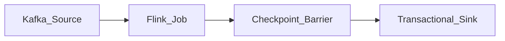

# Exactly-Once Semantics (EOS)

Message delivery guarantees define how an event broker and stream processor handle failures, retries, and state consistency.

## Delivery guarantees

1. **At-most-once** — Messages may be lost, never redelivered. Fire-and-forget telemetry.
2. **At-least-once** — No loss; duplicates possible. Consumers must be **idempotent**.
3. **Exactly-once (effectively-once)** — Each record processed once as far as business semantics require. Required for financial and inventory domains.

## How EOS is achieved

| Mechanism | Layer | Example |
| --- | --- | --- |
| Idempotent producer | Broker | Kafka `enable.idempotence` |
| Transactions | Broker + consumer | Kafka read-process-write transaction |
| Distributed snapshots | Processor | Flink checkpoint barriers |
| Idempotent sink | Sink | UPSERT by primary key |
| Outbox + CDC | Application | Atomic DB + event publish |

## End-to-end EOS requirements

1. **Source** — Replayable log with offset tracking.
2. **Processor** — Consistent checkpoints including operator state.
3. **Sink** — Participates in transactions or idempotent writes.

If the sink is a non-idempotent REST API, end-to-end EOS is **not** achievable — design compensations instead.

## Trade-off

EOS adds latency and throughput overhead. Default to **at-least-once + idempotent consumers** unless regulation or inventory correctness mandates EOS.

## Related

- [Outbox Pattern](../02.01.02.01.04_CDC_Architecture/02.01.02.01.04.03_Outbox_Pattern.md)
- [Flink State and Checkpoints](../../02.01.02.03_Open_Source/02.01.02.03.04_Apache_Flink/02.01.02.03.04.02_Flink_State_and_Checkpoints.md)
