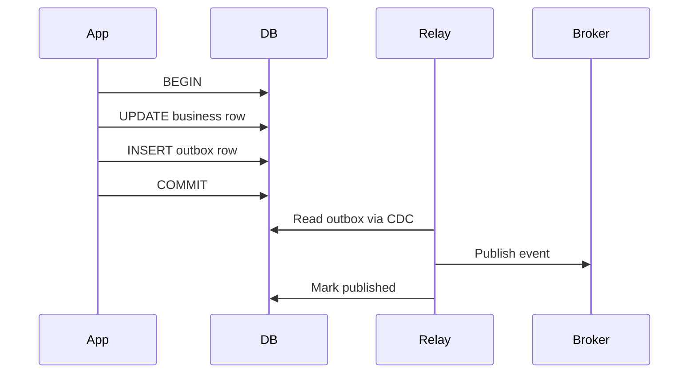

# Outbox Pattern

## Problem

A service must atomically update its database **and** publish an event. Dual writes to DB + broker without coordination cause duplicates or lost events on failure.

## Solution

Write the event to an **outbox table** in the same database transaction as the business write. A separate relay process (CDC or polling) publishes outbox rows to the event broker.

## Implementation options

| Approach | Pros | Cons |
| --- | --- | --- |
| Debezium on outbox table | Transactionally exact, scalable | Requires CDC infra |
| Polling publisher | Simple | Latency, missed ordering edge cases |
| Transactional outbox library | Framework integration | Vendor lock-in |

## Related

- [CDC Overview](02.01.02.01.04.01_CDC_Overview.md)
- [Outbox and Inbox Pattern](../../02.01.02.04_Architecture_Patterns/02.01.02.04.03_Integration_Patterns/02.01.02.04.03.01_Outbox_and_Inbox_Pattern.md)
- [Exactly Once Semantics](../02.01.02.01.03_Core_Concepts/02.01.02.01.03.03_Exactly_Once_Semantics.md)
