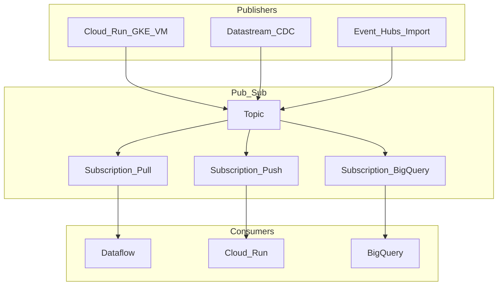

# Google Cloud Pub/Sub Architecture

Pub/Sub is Google's fully managed, serverless, real-time messaging service for decoupling publishers and subscribers across independent applications, regions, and organizations.

## Role in the enterprise

Use Pub/Sub as the **default GCP event backbone** when you want zero broker operations, elastic scale, and native integration with Dataflow, Cloud Run, Cloud Functions, Eventarc, and BigQuery. Prefer Kafka (or MSK) when you need long-lived partitioned logs, heavy replay semantics, or Kafka-native ecosystems without abstraction.

## Core concepts

| Concept | Definition |
| --- | --- |
| **Topic** | Named channel where publishers send messages. Topics are global resources within a project; physical routing is managed by Google. |
| **Subscription** | Named view of a single topic's message stream, with its own delivery policy, ack deadline, retention, and filters. |
| **Message** | Payload (`data`) plus optional **attributes** (key-value metadata for routing, filtering, and tracing). |
| **Publisher** | Producer client or service that publishes to a topic. |
| **Subscriber** | Consumer that receives messages via **pull** (including streaming pull) or **push** (HTTP webhook). |
| **Acknowledgement (ack)** | Subscriber confirms successful processing; unacked messages are redelivered after the ack deadline. |
| **Ordering key** | Optional key that enforces FIFO delivery for messages sharing the same key within a region. |
| **Message retention** | Topic-level retention (up to 31 days) enables replay by creating new subscriptions or using snapshots. |

## Reference topology

## Architectural differentiators (vs. Kafka)

| Dimension | Pub/Sub | Apache Kafka |
| --- | --- | --- |
| **Operations** | Serverless — no clusters, brokers, or partitions to manage | Self-managed or managed cluster; partition/replica planning required |
| **Scaling** | Automatic from zero to millions of msg/s | Scale via partition count and broker capacity |
| **Routing model** | Fan-out via subscriptions; **competing consumers** on one subscription share load | Partitioned log; consumer groups own partitions |
| **Ordering** | Per **ordering key** (regional); not global total order | Per-partition strict order |
| **Replay** | New subscription, snapshot, or retained messages on topic | Offset-based replay on same consumer group |
| **Exactly-once** | Native **exactly-once delivery** within a region (subscription feature) | Idempotent producer + transactions or dedup at app layer |
| **Retention** | Topic retention up to 31 days (configurable) | Unbounded retention with tiered storage options |
| **Ecosystem** | GCP-native (Dataflow, BigQuery subs, Eventarc) | Broad open-source and multi-cloud Kafka ecosystem |

### Serverless and routing

Pub/Sub eliminates broker sizing. Throughput scales with publish/subscribe volume; quotas apply per project and region (see [quotas](https://cloud.google.com/pubsub/quotas)). When five consumers attach to **one subscription**, Pub/Sub load-balances messages across available subscribers (compete-consumer). To broadcast the same event to five independent systems, create **five subscriptions** on the same topic.

### Ordering keys

Historically Pub/Sub did not guarantee order. **Ordering keys** now provide strict ordering for messages sharing the same key within a region — analogous to a Kafka partition, but without explicit partition management. Use ordering keys for entity-scoped sequences (e.g., `customer_id`, `device_id`). Hot keys can limit parallelism.

### Exactly-once delivery

Enable exactly-once delivery on a subscription to avoid duplicate processing in the subscriber for most regional pipelines — reducing need for application-level deduplication. Combine with idempotent sinks for end-to-end correctness. Cross-region fan-out may still require explicit dedup at boundaries.

## Push vs. pull subscriptions

| Mode | Mechanism | Best for |
| --- | --- | --- |
| **Pull** | Subscriber requests messages (`Pull` or **StreamingPull**) | High-throughput stream processing (Dataflow), batch workers, GKE consumers |
| **Push** | Pub/Sub POSTs to HTTPS endpoint (Cloud Run, Cloud Functions, App Engine) | Lightweight event-driven microservices, webhooks, serverless triggers |
| **BigQuery** | Managed export subscription | Analytics landing, audit logs, data lake ingestion |
| **Cloud Storage** | Managed file export | Archival, batch analytics, compliance dumps |

**Streaming pull** maintains a persistent bidirectional stream — preferred over synchronous pull for throughput. **Push** requires authenticated HTTPS endpoints, ack handling, and careful timeout/flow-control tuning to avoid push backlog.

## Performance tuning

### Publisher batching

Tune `maxMessages`, `maxBytes`, and `maxDelay` in the publisher client to batch small messages. Pub/Sub bills a **minimum of 1 KB per request** (not per message), so batching sub-1 KB messages materially reduces cost and API overhead.

### Subscriber flow control

Enforce `maxOutstandingMessages` and `maxOutstandingBytes` on subscribers to prevent OOM under burst load. Extend ack deadline for long-running handlers or use lease management APIs.

### Streaming pull

Prefer **StreamingPull** over unary Pull for sustained high throughput — reduces connection churn and improves latency stability.

### Regional co-location

Publish, subscribe, and process in the **same region** to minimize data transfer charges and latency. Cross-region delivery incurs standard GCP data transfer rates.

## Security and governance

- **IAM** — `roles/pubsub.publisher`, `roles/pubsub.subscriber`, or fine-grained topic/subscription-level policies.
- **CMEK** — customer-managed encryption keys for regulated workloads.
- **VPC Service Controls** — perimeter around Pub/Sub and downstream services.
- **Schema validation** — Pub/Sub schemas (Avro, Protocol Buffers) for contract enforcement.
- **Audit logs** — Admin Activity and Data Access logs for compliance.

## Integration patterns

| Pattern | Pub/Sub role |
| --- | --- |
| Event notification | Domain events from microservices to downstream handlers |
| CDC fan-out | Datastream → topic → multiple subscribers (warehouse, cache, search) |
| Stream processing | Topic → Dataflow (Beam) → lakehouse / real-time serving |
| Serverless automation | Topic → push → Cloud Run / Workflows |
| Analytics pipe | BigQuery subscription for near-real-time warehouse load |

## Learning guide

For hands-on depth — usage, scenarios, limits, costing, configuration recipes, evaluation criteria, and benchmarks — see the [Pub/Sub Learning Guide](02.01.02.02.02.04_Pub_Sub_Learning_Guide/README.md).

## Related

- [Cloud Streaming Reference Architecture](../02.01.02.02.01_Overview/02.01.02.02.01.01_Cloud_Streaming_Reference_Architecture.md)
- [Dataflow Architecture](02.01.02.02.02.02_Dataflow_Architecture.md)
- [Dataflow Learning Guide](02.01.02.02.02.05_Dataflow_Learning_Guide/README.md)
- [GCP Pub/Sub POC](02.01.02.02.02.03_GCP_PubSub_POC.md)
- [Pub/Sub vs Kafka](../../02.01.02.06_Comparisons/02.01.02.06.04_Pub_Sub_vs_Kafka.md)
- [GCP Pub/Sub pricing](https://cloud.google.com/pubsub/pricing) (official)
