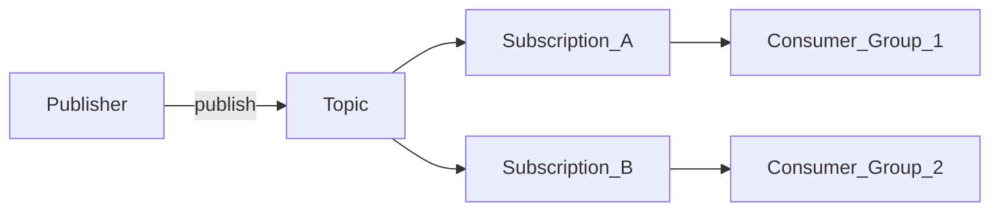

# 1. Pub/Sub Overview

## What is Google Cloud Pub/Sub?

Pub/Sub is a **fully managed, serverless messaging service** for asynchronous communication between independently deployed systems. Publishers send messages to a **topic** without knowing which applications will consume them. Subscribers receive messages through **subscriptions** attached to that topic.

It is the GCP-native equivalent of an enterprise message bus — optimized for cloud-native, event-driven, and real-time pipelines rather than long-lived log-centric streaming alone.

## Mental model

- **One topic, many subscriptions** — each subscription receives a copy of every message (fan-out).
- **One subscription, many subscribers** — subscribers compete for messages (load balancing).
- **At-least-once by default** — subscribers must ack; unacked messages are redelivered.
- **Exactly-once optional** — enable per subscription within a region for deduplicated delivery.

## When to use Pub/Sub

| Use Pub/Sub when… | Consider alternatives when… |
| --- | --- |
| You want zero broker operations on GCP | You need Kafka protocol compatibility everywhere |
| Workloads are bursty or scale from idle to peak | You need multi-day replay on a single consumer offset |
| You integrate heavily with Dataflow, BigQuery, Cloud Run | You require cross-cloud identical broker semantics |
| Fan-out to many independent consumers is common | Partition-level ordering across all keys without hot-spot planning |
| Regional exactly-once is sufficient | You need complex stream joins/state at broker level |

## Pub/Sub vs event streaming vs message queues

| Style | Example on GCP | Character |
| --- | --- | --- |
| **Message queue** | Pub/Sub (competing consumers) | Decouple services, work distribution |
| **Event bus** | Pub/Sub (fan-out subscriptions) | Domain events to many systems |
| **Stream processing** | Pub/Sub → Dataflow | Continuous transformation and aggregation |
| **Durable log** | Kafka / BigQuery storage | Replay, compaction, analytics history |

## Key capabilities at a glance

- Global topics with regional delivery semantics
- Push and pull (including streaming pull) subscriptions
- Message filtering on attributes
- Ordering keys for per-key FIFO
- Exactly-once delivery (regional)
- Topic message retention (up to 31 days) and snapshots
- Schema validation (Avro, Protobuf)
- Dead-letter topics
- BigQuery and Cloud Storage export subscriptions
- Import topics (Kinesis, MSK, Confluent, Event Hubs, Cloud Storage)

## Learning path

Continue to [Architecture](02.01.02.02.02.04.02_Architecture.md) for component-level design, or jump to [Scenarios](02.01.02.02.02.04.04_Scenarios.md) for enterprise patterns.

## Related

- [Pub/Sub Architecture](../02.01.02.02.02.01_Pub_Sub_Architecture.md)
- [How to Use](02.01.02.02.02.04.03_How_To_Use.md)
