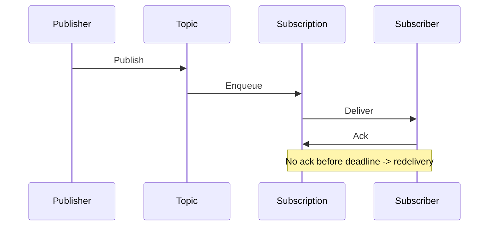

# 2. Architecture of Cloud Pub/Sub

## Control plane vs data plane

| Plane | Responsibility |
| --- | --- |
| **Control plane** | Topic/subscription/schema CRUD, IAM, snapshots, labels, monitoring — via Console, gcloud, Terraform, client admin APIs |
| **Data plane** | Publish, pull/streaming pull, push delivery, ack/nack, lease extension — high-scale message path managed by Google |

You do not provision brokers or partitions. Capacity is elastic within [project quotas](https://cloud.google.com/pubsub/quotas).

## Core components

### Topic

- Named resource: `projects/{project}/topics/{topic}`
- Receives all messages from publishers
- Optional: message retention, schema binding, KMS encryption, ingest audit logging
- Messages are immutable once published

### Subscription

- Binds to exactly one topic
- Maintains delivery state per message (pending, acked, expired)
- Configurable: ack deadline, retry policy, dead-letter topic, filter, exactly-once, message ordering
- Types: pull, push, BigQuery, Cloud Storage

### Message structure

```
PubsubMessage {
  data: bytes           // payload (up to 10 MB)
  attributes: map       // up to 100 attributes; filter/routing metadata
  orderingKey: string   // optional FIFO key
  messageId: string     // unique id
  publishTime: timestamp
}
```

Billable volume = encoded `data` + attributes + fixed overhead (~20 B timestamp + message_id + optional fields). **Minimum 1 KB per publish/pull/push request.**

## Delivery semantics



| Mode | Semantics | Notes |
| --- | --- | --- |
| Default | At-least-once | Idempotent handlers required |
| Exactly-once (subscription flag) | Deduped delivery within region | Enable for billing-sensitive or side-effecting sinks |
| Ordering keys | Per-key order | Parallelism across different keys |

## Fan-out vs compete

**Fan-out:** Topic `orders` with subscriptions `warehouse`, `analytics`, `notifications` — each receives every order event.

**Compete:** Subscription `order-processor` with three Cloud Run instances — each message delivered to one instance only.

## Push architecture

Pub/Sub initiates HTTPS POST to your endpoint with JWT authentication. You respond with HTTP success to ack (or implement separate ack in pull-style push handlers per client library). Configure push endpoint, authentication service account, and attribute overrides.

**Risk:** Slow endpoints cause push backlog; tune concurrency and min/max backoff.

## Pull and streaming pull

- **Unary Pull:** Request/response; higher overhead at scale.
- **StreamingPull:** Long-lived stream; server pushes messages as available — **recommended for throughput**.

Dataflow and high-volume GKE consumers use streaming pull under the hood.

## Ordering keys

Messages with the same ordering key are delivered in publish order to subscribers on that subscription (with ordering enabled). Different keys process in parallel. Design keys to avoid hotspots (e.g., not a single key for all traffic).

## Exactly-once delivery

When enabled on a subscription, Pub/Sub suppresses duplicate deliveries within a region for the same message under normal operation. Still implement **idempotent sinks** for cross-service end-to-end guarantees and disaster recovery scenarios.

## Retention and replay

| Mechanism | Use |
| --- | --- |
| Topic message retention | Retain published messages up to 31 days for late subscribers |
| Subscription retention | Retain unacked (and optionally acked) messages |
| Snapshots | Point-in-time subscription state for replay workflows |
| Seek | Replay from timestamp or snapshot (pull subscriptions) |

## Multi-region considerations

Topics are global names; physical storage and delivery are regional. Cross-region subscribers incur **data transfer** charges. For lowest latency and cost, align publishers, topics usage, and subscribers in one region.

## Security architecture

- IAM at project, topic, subscription level
- Service account impersonation for push auth
- CMEK for encryption at rest
- VPC-SC perimeters
- Private Google Access for on-prem/private VPC publishers
- Audit logs to Cloud Logging

## Related

- [Overview](02.01.02.02.02.04.01_Overview.md)
- [How to Use](02.01.02.02.02.04.03_How_To_Use.md)
- [Limitations](02.01.02.02.02.04.05_Limitations_And_Scenarios.md)
- [Official architecture docs](https://cloud.google.com/pubsub/docs/architecture)
