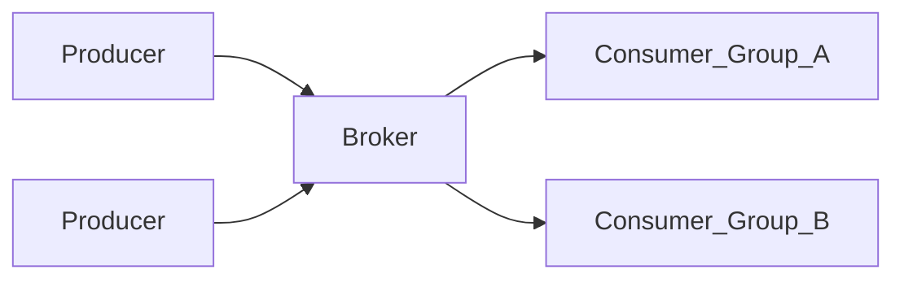

# Apache Kafka Architecture

## Role in the enterprise

Kafka is the default **durable event log** for high-throughput, multi-subscriber streaming. It decouples producers and consumers with replayable, partitioned topics.

## Core components

| Component | Responsibility |
| --- | --- |
| Broker | Stores partitions, serves produce/fetch |
| Topic | Named log divided into partitions |
| Partition | Ordered, immutable sequence; unit of parallelism |
| Consumer group | Cooperative consumers sharing partition assignment |
| ZooKeeper / KRaft | Cluster metadata (KRaft preferred for new clusters) |
| Connect | Source/sink connectors (CDC, warehouses) |
| Streams | Lightweight stream processing library |

## Topology

## Enterprise design decisions

- **Partition key** — drives ordering and hot-spot risk; align with business shard (customer_id, region).
- **Retention** — time vs size; compliance may require tiered storage or compaction.
- **Compaction** — keyed changelog topics for KTables and CDC deduplication.
- **Replication factor** — minimum 3 in production; `min.insync.replicas=2`.
- **Security** — mTLS or SASL, ACLs per topic/principal.

## Managed options

- Confluent Cloud, Amazon MSK, Azure Event Hubs (Kafka protocol), Aiven, Redpanda (Kafka-compatible).

## Related

- [Kafka Topics and Partitions](02.01.02.03.02.02_Kafka_Topics_and_Partitions.md)
- [Kafka Streams](02.01.02.03.02.03_Kafka_Streams.md)
- [Enterprise Kafka Platform](../../02.01.02.04_Architecture_Patterns/02.01.02.04.05_Reference_Architectures/02.01.02.04.05.01_Enterprise_Kafka_Platform.md)
- [Vendor evaluation](../../../17_Technology_Comparisons/17.08_Vendor_Evaluations/Integration_Vendor_Evaluation/Kafka_Ecosystem_Evaluation.md)
