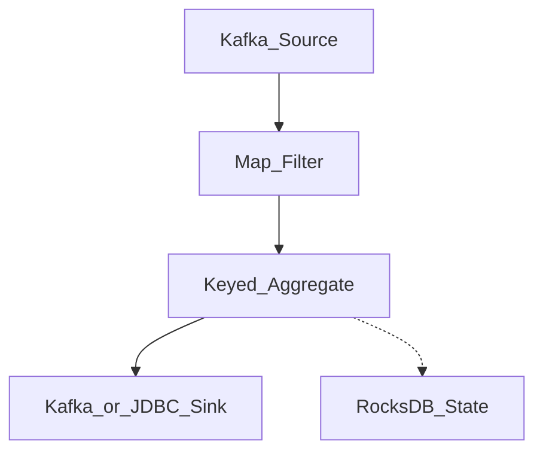

# Apache Flink Architecture

## Role in the enterprise

Flink is a **stateful stream processing engine** optimized for event-time semantics, exactly-once checkpoints, and complex event processing at scale.

## Runtime model

| Concept | Description |
| --- | --- |
| JobManager | Coordinates scheduling, checkpoints, failover |
| TaskManager | Executes operators, holds keyed state |
| Operator | Parallel unit of work in the DAG |
| Checkpoint | Consistent distributed snapshot (Chandy-Lamport) |
| Savepoint | Manual checkpoint for upgrades and reprocessing |

## Dataflow

## Enterprise capabilities

- **Event time + watermarks** — correct windowing with out-of-order data.
- **Exactly-once** — end-to-end with transactional sinks and two-phase commit.
- **CEP** — pattern detection for fraud and IoT.
- **SQL / Table API** — democratized stream SQL with Flink SQL Gateway.

## When to choose Flink

| Choose Flink | Consider alternatives |
| --- | --- |
| Sub-second latency aggregations | Spark Structured Streaming for unified batch+stream teams |
| Complex stateful joins | ksqlDB for Kafka-only simpler topologies |
| Large state (RocksDB) | Managed Dataflow for GCP-native teams |

## Related

- [Flink State and Checkpoints](02.01.02.03.04.02_Flink_State_and_Checkpoints.md)
- [Watermarks](../../../02.01.02.05_Benchmarks/02.01.02.05.02_Watermarks.md)
- [Exactly Once Semantics](../../02.01.02.01_Fundamentals/02.01.02.01.03_Core_Concepts/02.01.02.01.03.03_Exactly_Once_Semantics.md)
