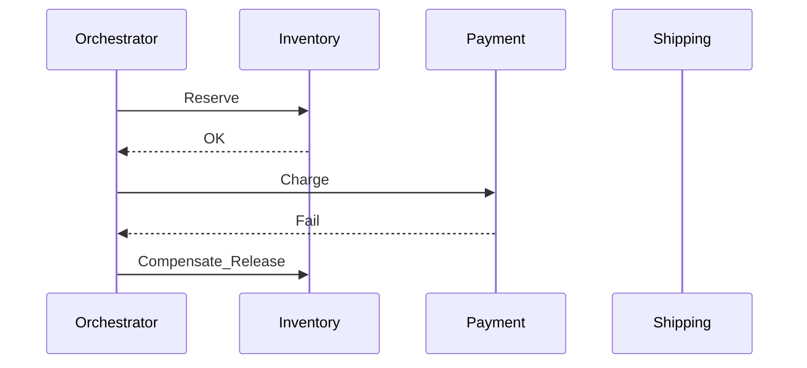

# Saga Pattern

## Problem

Distributed microservices cannot use a single ACID transaction across services. A saga coordinates a **sequence of local transactions** with compensating actions on failure.

## Saga styles

| Style | Implementation | Trade-off |
| --- | --- | --- |
| Choreography saga | Each service listens and publishes compensating events | Simple start; hard to debug |
| Orchestration saga | Central saga manager issues steps and compensations | Clear state; single point to harden |

## Example: order fulfillment

## Design rules

1. Every forward step has a **defined compensating action** (or is pivotally idempotent).
2. Sagas are **long-running** — persist saga state durably.
3. Use **idempotent consumers** — at-least-once delivery is the norm.
4. Align timeouts with business SLAs; emit `SagaTimedOut` for escalation.

## Streaming integration

Stream processors can drive saga timeouts and deadline events (Flink CEP, Kafka Streams punctuators). Event log provides audit trail for compliance.

## Related

- [Choreography vs Orchestration](../02.01.02.04.01_Event_Driven_Patterns/02.01.02.04.01.01_Choreography_vs_Orchestration.md)
- [Outbox Pattern](../../02.01.02.01_Fundamentals/02.01.02.01.04_CDC_Architecture/02.01.02.01.04.03_Outbox_Pattern.md)
