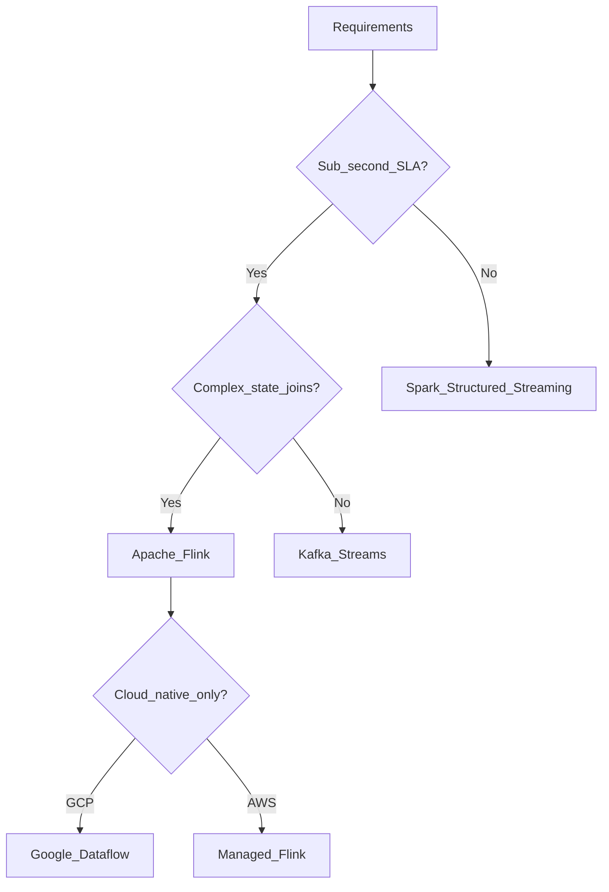

# Stream Processor Selection Framework

## Decision flow

## Evaluation criteria

| Criterion | Weight | Notes |
| --- | ---: | --- |
| Latency & event time | High | Flink, Dataflow excel |
| Team skills | High | Spark if batch team already expert |
| State size | Medium | Flink RocksDB for large keyed state |
| Operational model | Medium | Managed vs self-hosted |
| Kafka coupling | Medium | Kafka Streams if topology is Kafka-only |
| SQL accessibility | Low | Flink SQL, ksqlDB |

## Outputs

Document choice in an ADR under `00.03` with workload profile, NFRs, and rejected alternatives.

## Related

- [Flink vs Spark Structured Streaming](02.01.02.06.02_Flink_vs_Spark_Structured_Streaming.md)
- [Flink Architecture](../02.01.02.03_Open_Source/02.01.02.03.04_Apache_Flink/02.01.02.03.04.01_Flink_Architecture.md)
- [Technology Comparisons](../../../17_Technology_Comparisons/README.md)
