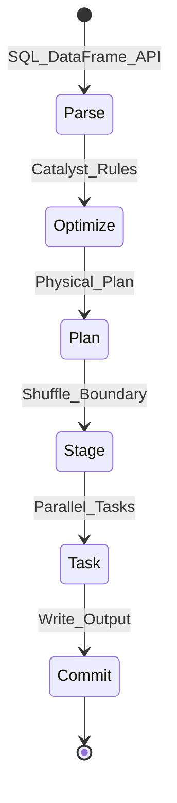

# 2. Architecture of Apache Spark

## Cluster architecture

| Component | Role |
| --- | --- |
| **Driver** | SparkContext/SparkSession, DAGScheduler, TaskScheduler |
| **Cluster Manager** | YARN, Kubernetes, Mesos, or standalone |
| **Executor** | JVM process running tasks; caches partitions |
| **Catalog** | Hive, Glue, Unity, Iceberg REST |

## Job lifecycle

## Shuffle and partitioning

- **Hash partition** - equi-joins, group-by keys.
- **Range partition** - order-sensitive ops (limited).
- **Coalesce/repartition** - control output file count (target 128MB-1GB objects).
- **Adaptive Query Execution (AQE)** - runtime skew join handling, coalesce shuffle partitions.

## Lakehouse integration

| Format | Spark integration |
| --- | --- |
| **Delta Lake** | ACID MERGE, time travel, OPTIMIZE/VACUUM |
| **Iceberg** | Hidden partitioning, branch/tag, merge-on-read |
| **Hudi** | Upsert, incremental pull, clustering |

## Production checklist

- Dynamic partition overwrite for idempotent daily loads
- Broadcast joins only under size threshold (~10-50MB tuned)
- Speculative execution for straggler mitigation
- Event logging to Spark History Server / OTel

## Related

- [Dataproc Learning Guide](../../02.02.01.02_Cloud_Services/02.02.01.02.02_GCP/02.02.01.02.02.03_Dataproc_Spark_Learning_Guide/README.md)
- [EMR Spark Learning Guide](../../02.02.01.02_Cloud_Services/02.02.01.02.03_AWS/02.02.01.02.03.04_EMR_Spark_Learning_Guide/README.md)
