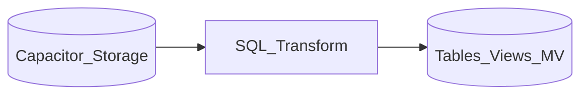

# 1. BigQuery SQL Transformation Overview

## What is BigQuery for transformation?

**BigQuery** is GCP's serverless **ELT warehouse** - transformations run as SQL jobs (scheduled queries, dbt, Dataform, stored procedures) with separation of storage and compute, slot-based or on-demand billing.

## Mental model

## When to use BigQuery transforms

| Use BigQuery when... | Consider alternatives when... |
| --- | --- |
| Data already in **BQ datasets** | Heavy file-based lake -> Dataproc Spark |
| **Serverless** SQL marts with dbt/Dataform | Complex UDF graph on Parquet -> Spark |
| **BigQuery ML** in same pipeline | Multi-cloud portable code -> Spark + Iceberg |

## Related

- [Cloud Batch Reference](../../02.02.01.02.01_Overview/02.02.01.02.01.01_Cloud_Batch_Transformation_Reference.md)
