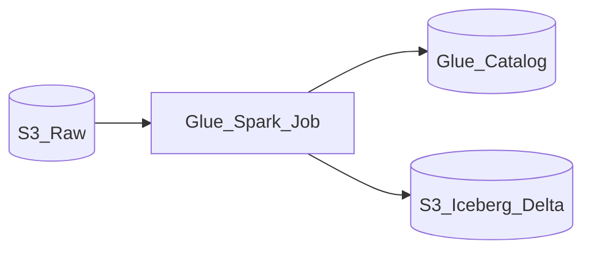

# 1. AWS Glue ETL Overview

## What is AWS Glue ETL?

**AWS Glue** provides **managed Apache Spark** ETL jobs with visual Studio authoring, Data Catalog integration, job bookmarks for incremental processing, and Flex execution for cost optimization.

## Mental model

## When to use Glue ETL

| Use Glue when... | Consider alternatives when... |
| --- | --- |
| **AWS-native** lake on S3 + Catalog | Portable Airflow DAGs on any cloud -> EMR + MWAA |
| **Job bookmarks** incremental ingest+transform | Heavy custom Spark tuning -> EMR |
| **Studio visual** ETL for citizen integrators | Complex multi-service orchestration -> Step Functions + Lambda |

## Glue ETL vs EMR vs Athena

| Service | Role |
| --- | --- |
| **Glue ETL** | Managed Spark transforms |
| **EMR** | Full cluster control, Spark/Flink/Presto |
| **Athena** | SQL on catalog tables (ELT query layer) |
