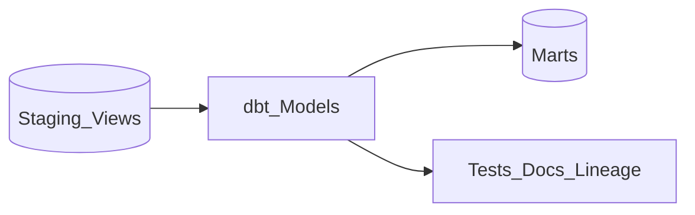

# 1. dbt Overview

## What is dbt?

**dbt (data build tool)** is the industry-standard **SQL-first transformation framework** for warehouses and lakehouse SQL engines. It compiles modular SQL models, runs tests, generates docs, and integrates with Git-based CI/CD.

## Mental model

- **Models** - `SELECT` statements materialized as view/table/incremental.
- **Sources** - declared upstream tables with freshness checks.
- **Tests** - uniqueness, not-null, relationships, custom SQL.
- **Macros/Jinja** - reusable SQL abstractions.

## When to use dbt

| Use dbt when... | Consider alternatives when... |
| --- | --- |
| Transform logic lives in **Snowflake/BQ/Redshift/Databricks SQL** | Heavy graph algorithms / ML on files -> **Spark** |
| Analytics engineering owns **Git + PR** workflow | Complex event-time streaming -> **Flink** |
| Need **lineage, docs, tests** out of the box | Legacy GUI ETL only shop -> Informatica/Talend |

## dbt vs Spark vs warehouse-native

| Approach | Best for |
| --- | --- |
| **dbt** | Modular SQL marts, testing, documentation |
| **Spark** | Lake file processing, complex distributed UDFs |
| **Native stored procs** | Simple, DBA-centric, no Git culture |
