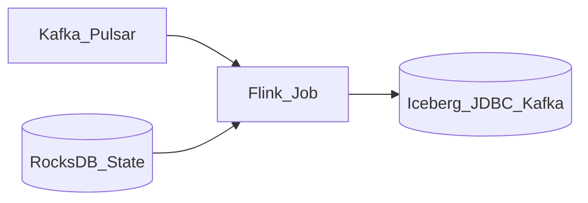

# 1. Apache Flink Overview

## What is Apache Flink?

**Apache Flink** is the leading **stateful stream processing** engine for transformation with event-time semantics, exactly-once checkpoints, and CEP. It powers real-time silver/gold layers, CDC propagation, and stream-table duality via Flink SQL.

## Mental model

## When to use Flink

| Use Flink when... | Consider alternatives when... |
| --- | --- |
| **Event-time** windows, watermarks, late data | Minute-level micro-batch OK -> Spark Structured Streaming |
| **Stateful** aggregations (sessions, funnel) | Simple filter/map -> Kafka Streams |
| **Exactly-once** end-to-end with Kafka + lake | Managed serverless -> **Dataflow** / **Managed Flink** |
| **SQL + DataStream** unified API | Batch-only TB scans -> Spark |

## Flink vs Spark Streaming vs Kafka Streams

| Engine | Latency | State | Ops complexity |
| --- | --- | --- | --- |
| **Flink** | ms-s | Rich | Medium-High |
| **Spark SS** | s-min | Micro-batch | Medium |
| **Kafka Streams** | ms | Per-app | Lower (library) |
