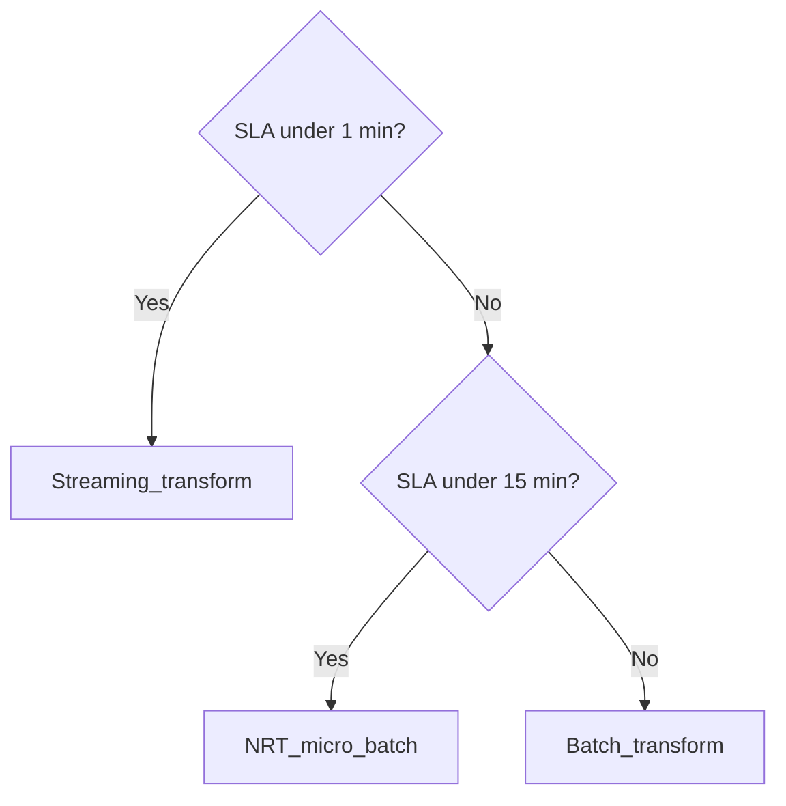

# NRT Transformation Strategy

## Definition

**Near-real-time (NRT) transformation** sits between batch (minutes–hours SLA) and streaming (sub-second). It delivers curated data within **seconds to low minutes** using **micro-batch**, **trigger-based**, or **short-interval scheduled** execution.

## When to choose NRT

| Signal | NRT fit |
| --- | --- |
| Business SLA 1–15 minutes | Strong |
| Source is CDC or incremental files | Strong |
| Need exactly-once lakehouse silver | Strong with Delta/Iceberg MERGE |
| Sub-second alerting on raw events | Use streaming instead |
| Daily/monthly reporting only | Use batch |

## Latency tiers

| Tier | Interval | Typical engines |
| --- | --- | --- |
| **T1** | 30s–2m | Spark SS trigger, Databricks trigger, Dataflow streaming |
| **T2** | 2–15m | Orchestrated micro-batch, Fabric pipelines |
| **T3** | 15–60m | Scheduled warehouse SQL, Glue Flex jobs |

## Architecture decision flow

## Design principles

1. **Idempotent sinks** — MERGE/upsert by business key; never blind append on updates.
2. **Watermark late data** — define max lateness for micro-batch windows.
3. **Cost vs freshness** — smaller trigger interval = higher cost; measure marginal value.
4. **Unified model** — same silver schema whether batch backfill or NRT incremental.

## Related

- [Micro-Batch Patterns](../02.02.03.01.02_Micro_Batch_Patterns/02.02.03.01.02.01_Micro_Batch_Transform_Patterns.md)
- [Batch vs Stream vs NRT](../../02.02.03.06_Comparisons/02.02.03.06.01_Batch_vs_Streaming_vs_NRT_Transform.md)
