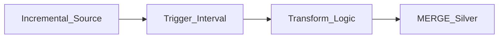

# Micro-Batch Transform Patterns

## Core pattern

Micro-batch reads **incremental input** (Kafka offset range, file arrival, CDC batch) and writes **curated output** on a fixed trigger.



## Pattern catalog

| Pattern | Input | Output | Notes |
| --- | --- | --- | --- |
| **Append-only facts** | Event stream | Partitioned fact table | Dedup by event_id |
| **CDC upsert** | Debezium/DMS batch | SCD Type 1/2 silver | MERGE on primary key |
| **File landing** | New objects in prefix | Bronze→Silver promotion | List after orchestration sensor |
| **Warehouse incremental** | Streams + tasks | Staging views | Snowflake/BQ native |

## Spark Structured Streaming micro-batch

```python
spark.readStream.format("delta").load("/bronze/orders") \
  .withWatermark("event_time", "10 minutes") \
  .groupBy(window("event_time", "5 minutes"), "region") \
  .agg(F.sum("amount").alias("total")) \
  .writeStream.format("delta").outputMode("append") \
  .trigger(processingTime="1 minute") \
  .start("/gold/orders_5m")
```

## Anti-patterns

- Running full-table scans every trigger interval.
- No checkpoint location for streaming/micro-batch jobs.
- Mixing batch and NRT writes to same table without isolation level plan.

## Related

- [Trigger-Based Transforms](02.02.03.01.02.02_Trigger_Based_Transforms.md)
- [Latency Tiers](02.02.03.01.02.03_Latency_Tiers.md)
