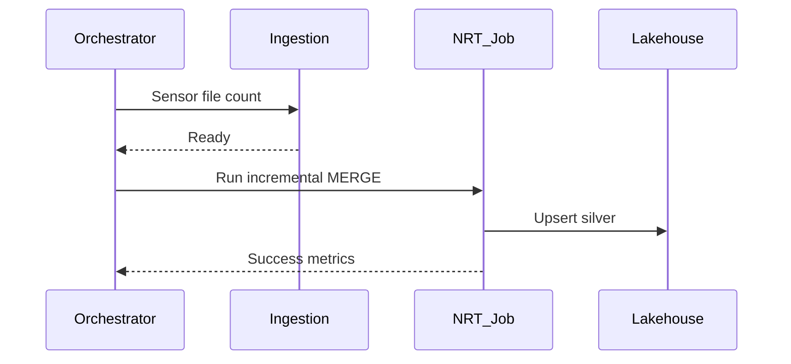

# Trigger-Based Transforms

## Trigger types

| Trigger | Engine examples | Use case |
| --- | --- | --- |
| **Processing time** | Spark SS, Dataflow | Regular freshness, simple ops |
| **Available-now** | Spark SS (legacy) | Process as fast as possible |
| **Once** | Spark SS, Beam | Backfill single batch |
| **Continuous** | Spark SS experimental | Low latency micro-batch |
| **Orchestrator cron** | Airflow, Dagster | Warehouse SQL every N minutes |
| **Event-driven** | Lambda, Cloud Functions | File arrival, queue message |

## Orchestration-triggered NRT



## Databricks trigger example

```python
# Delta Live Tables / structured streaming pipeline
@dlt.table
def silver_orders():
    return spark.readStream.table("bronze.orders") \
        .withWatermark("order_ts", "15 minutes") \
        .dropDuplicates(["order_id"])
```

## Operational checklist

- [ ] Trigger interval documented in SLA matrix
- [ ] Checkpoint/watermark paths on durable storage
- [ ] Alert on processing delay > 2Ã- trigger interval
- [ ] Backfill procedure uses same MERGE logic

## Related

- [Integration: Orchestration Triggers](../../02.02.03.08_Integration_Patterns/02.02.03.08.01_Orchestration_Triggers.md)
