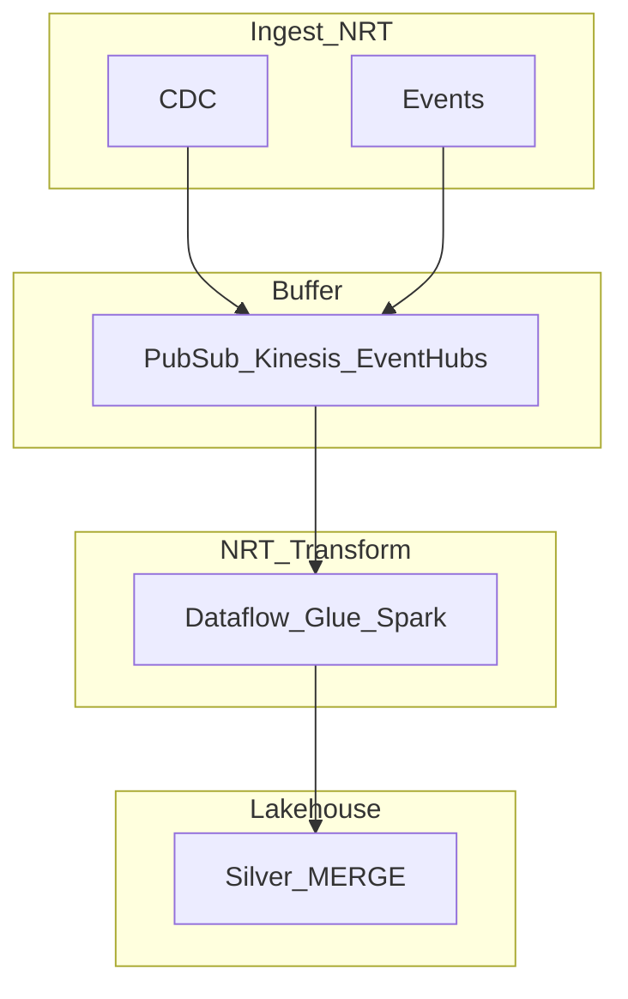

# Cloud NRT Transformation Reference Architecture

## Purpose

Hyperscaler mapping for **near-real-time transformation** — micro-batch triggers on managed compute, landing in lakehouse or warehouse silver layers.

## Hyperscaler matrix

| Capability | GCP | AWS | Azure |
| --- | --- | --- | --- |
| Micro-batch engine | Dataflow (Beam) | Glue Streaming / EMR SS | Synapse Spark / Fabric |
| Trigger model | Streaming + batch | Glue job bookmark + SS trigger | Pipeline schedule / Eventstream |
| Lakehouse sink | BigQuery + GCS Delta | S3 Iceberg/Delta + Athena | OneLake Delta |
| Orchestration | Cloud Composer | Step Functions / MWAA | ADF / Fabric pipelines |

## Reference diagram

## Design principles

1. **MERGE idempotency** on silver tables for all NRT paths.
2. **Autoscale** micro-batch workers; avoid fixed oversized clusters.
3. **Private networking** between broker and transform compute.
4. **FinOps** — trigger interval directly drives DPU/vCore hours.

## Related

- [GCP Dataflow Micro-Batch](../02.02.03.02.02_GCP/02.02.03.02.02.01_GCP_Dataflow_Micro_Batch.md)
- [Databricks Trigger](../02.02.03.02.03_AWS/02.02.03.02.03.02_Databricks_Trigger_Transforms.md)
