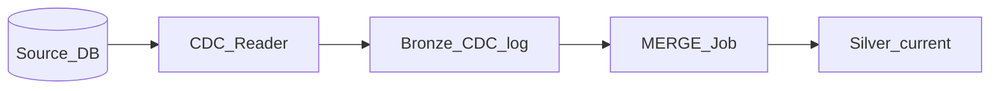

# CDC Silver Merge Pattern

## Flow

CDC events (insert/update/delete) land in bronze; micro-batch job MERGEs into silver SCD Type 1 or Type 2.



## MERGE template (Type 1)

```sql
MERGE INTO silver.product AS t
USING bronze.product_cdc AS s ON t.product_id = s.product_id
WHEN MATCHED AND s.op = 'D' THEN DELETE
WHEN MATCHED THEN UPDATE SET name = s.name, price = s.price, updated_at = s.ts
WHEN NOT MATCHED AND s.op != 'D' THEN INSERT *
```

## Type 2 extension

Close prior row (`valid_to = s.ts`), insert new current row with `valid_from = s.ts`.

## Related

- [SCD Patterns](../../../02.02.04_Shared_Foundations/02.02.04.01_Fundamentals/02.02.04.01.04_SCD_And_Slowly_Changing/02.02.04.01.04.01_SCD_Type_1_Patterns.md)
