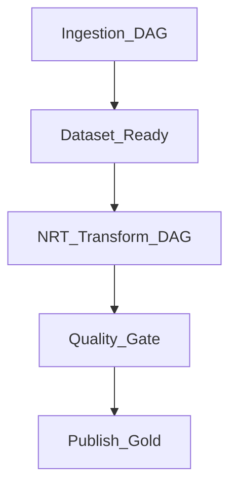

# Trigger Orchestration for NRT

## Pattern

Orchestrator owns **when**; engine owns **how**. Sensors gate runs until ingest completes.

| Orchestrator | Sensor type | Transform action |
| --- | --- | --- |
| Airflow | S3/GCS prefix | Trigger Glue/Spark job |
| Dagster | Asset materialization | Run op with incremental config |
| Step Functions | EventBridge rule | Lambda + EMR step |
| Fabric | Pipeline schedule | Notebook MERGE |

## Dependency graph

## Related

- [Orchestration Triggers](../../02.02.03.08_Integration_Patterns/02.02.03.08.01_Orchestration_Triggers.md)
