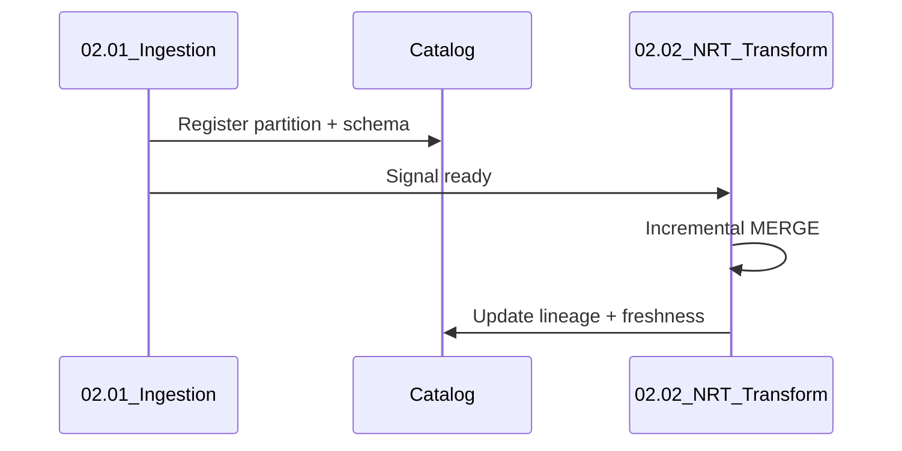

# NRT Ingestion Handoff

## Contract between ingest and transform

1. **Landing zone** — bronze path, format, partition scheme documented.
2. **Completion signal** — `_SUCCESS` file, metadata table row, or orchestrator dataset.
3. **Schema version** — compatibility matrix in catalog.
4. **SLA clock starts** at completion signal, not source event time.

## Sequence

## Related

- [02.01 Ingestion Architecture](../../../02.01_Data_Ingestion_Architecture/README.md)
