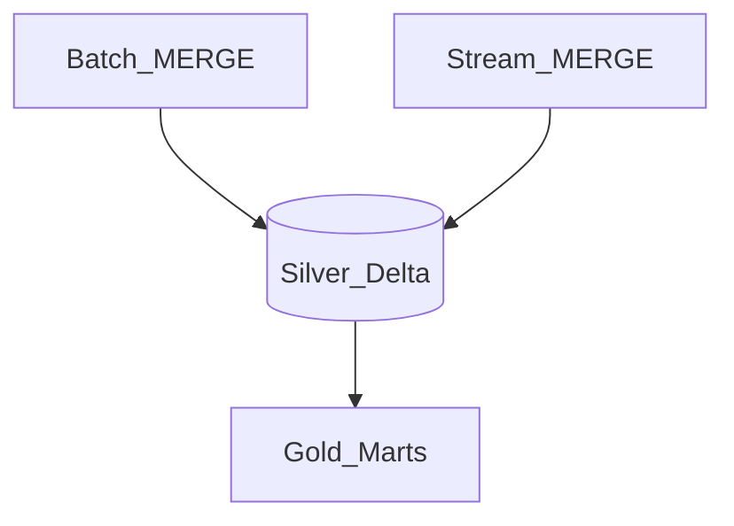

# Cross-Mode Transformation (Batch + Stream Unified Models)

## Lambda vs Kappa vs unified

| Architecture | Description |
| --- | --- |
| **Lambda** | Batch + speed layer merge |
| **Kappa** | Single stream reprocess for history |
| **Unified (lakehouse)** | Same Delta/Iceberg tables; batch backfill + stream incremental |

## Unified silver table

## Rules

1. Same MERGE keys and column contracts for batch and stream writers.
2. Batch reconciles stream gaps nightly.
3. Single catalog registration for both paths.
