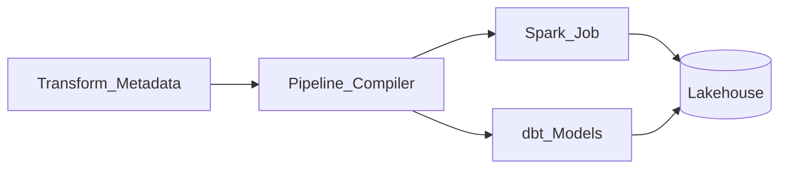

# Metadata-Driven Transform Platform Reference

## Concept

Transform definitions stored as **metadata** (YAML/JSON in Git); engine compiles to Spark SQL/dbt at runtime.

## Components

- **Registry** — entity/attribute business glossary.
- **Rules engine** — mapping source → target columns.
- **Lineage** — automatic from metadata graph.
- **Orchestrator** — executes compiled artifacts.

## Benefits

- Reduce copy-paste across domains.
- Enforce naming and DQ standards centrally.
