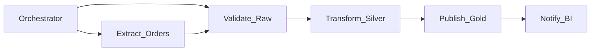
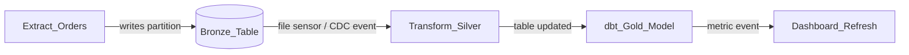

# Orchestration vs Choreography (Data Pipelines)

## Definitions

| Style | Control | Coupling | Visibility | Typical runtime |
| --- | --- | --- | --- | --- |
| **Orchestration** | Central coordinator defines and drives task order | Explicit workflow graph (DAG) | Full run history in one system | Airflow, Dagster, Step Functions |
| **Choreography** | Each pipeline reacts to events or data changes independently | Implicit via topics, files, or table updates | Distributed; end-to-end trace needs correlation IDs | Kafka consumers, event-driven dbt, file watchers |

In **data orchestration**, the coordinator is usually a workflow engine that knows the full DAG. In **choreography**, downstream jobs start when they detect upstream completion (new partition in S3, `INSERT` into staging table, message on a topic).

## Data pipeline examples

### Orchestrated (explicit DAG)

The orchestrator will not run `Transform_Silver` until `Validate_Raw` succeeds. Backfills replay the same graph for historical dates.

### Choreographed (event / data triggered)

No single system owns the full graph. Each team configures triggers on shared storage or the catalog.

## Comparison for data engineering

| Criterion | Orchestration | Choreography |
| --- | --- | --- |
| **Best for** | Multi-team SLAs, regulated batch, complex branching | High decoupling, domain-owned micro-pipelines |
| **Dependency model** | Declared edges, sensors, dataset triggers | Implicit (data landing, events) |
| **Failure visibility** | Central failed-task UI, alerting | Must aggregate across systems |
| **Backfill** | Native (`execution_date`, partition params) | Manual re-emission or per-consumer replay |
| **Change impact** | DAG change review | Contract/schema change on shared outputs |
| **Scaling teams** | Platform team owns orchestrator standards | Strong data contracts and catalog discipline |
| **Latency** | Schedule-bound (minutes–hours typical) | Can be near-real-time on events |

## When to choose orchestration

- Finance, compliance, or executive reporting with **named SLAs** and audit trails.
- Pipelines with **conditional logic** (if validation fails, quarantine branch; else promote).
- **Cross-domain** workflows spanning ingestion, dbt, ML training, and export in one run.
- Need **single-pane** operations for hundreds of pipelines.

## When to choose choreography

- Domain teams publish **data products**; consumers subscribe via catalog or events.
- **Streaming-first** platform where batch orchestration is the exception.
- Microservices-style data mesh with **autonomous domains** and minimal central workflow ownership.
- Latency targets under minutes and event buses already exist (Kafka, Pub/Sub).

## Hybrid pattern (recommended at enterprise scale)

Most mature platforms combine both:

| Layer | Pattern | Mechanism |
| --- | --- | --- |
| **Within domain** | Orchestration | Domain DAG: raw → curated → mart |
| **Across domains** | Choreography | Domain A publishes `orders_curated`; Domain B's sensor or dataset trigger starts attribution DAG |
| **Critical path** | Orchestration | End-of-day close DAG with explicit SLA monitoring |
| **Real-time path** | Choreography | Stream processors + materialized views; batch orchestrator only for reconciliation |

**Orchestration provides control; choreography provides scale and decoupling.** Use orchestration where visibility and SLAs dominate; use choreography where team autonomy and event latency dominate.

## Anti-patterns

- **Hidden choreography in orchestrator** — Hundreds of time-based sensors with no documented data contract (fragile, hard to debug).
- **Central mega-DAG** — One orchestrator owns all domains; becomes a bottleneck and blast radius.
- **Choreography without contracts** — Downstream jobs break silently when upstream schema changes.

## Related

- [What Is Data Orchestration](02.03.01.01.01_What_Is_Data_Orchestration.md)
- [Dependency Management](../02.03.01.03_Core_Concepts/02.03.01.03.02_Dependency_Management.md)
- [Active Metadata](../02.03.01.06_Active_Metadata/02.03.01.06.01_Active_Metadata.md)
- [Choreography vs Orchestration (Streaming)](../../../02.01_Data_Ingestion_Architecture/02.01.02_Streaming/02.01.02.04_Architecture_Patterns/02.01.02.04.01_Event_Driven_Patterns/02.01.02.04.01.01_Choreography_vs_Orchestration.md)
