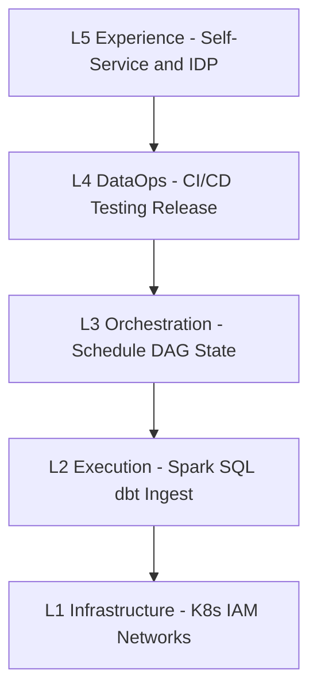

# Orchestration Reference Model

Enterprise data orchestration spans five layers. Each layer has distinct ownership, tooling, and failure modes. This model aligns batch DAG engines, DataOps practices, and active metadata into a single reference architecture.

## Layer overview

| Layer | Purpose | Primary artifacts | Typical owners |
| --- | --- | --- | --- |
| **L1 — Infrastructure** | Compute, storage, networking, secrets | Clusters, VPCs, service accounts | Platform / cloud engineering |
| **L2 — Execution** | Data movement and transformation logic | Spark jobs, SQL, dbt models, connectors | Data engineering |
| **L3 — Orchestration** | When tasks run, dependencies, retries, SLAs | DAGs, task groups, sensors, datasets | Data platform / DE |
| **L4 — DataOps** | Build, test, promote pipeline code | Git repos, CI pipelines, integration tests | Data platform + DE |
| **L5 — Experience** | Discover, request, operate pipelines | Catalog, IDP portals, runbooks | Data platform + governance |

## L3 — Orchestration components

| Component | Function | Implementation examples |
| --- | --- | --- |
| **Scheduler** | Enqueue DAG runs by cron, interval, or external trigger | Airflow `DagBag` scheduler loop; Prefect deployments |
| **DAG parser** | Load workflow definitions from Python/YAML/repo | `dag_processor`; Dagster `@job` |
| **Metadata database** | Persist DAG runs, task instances, variables, connections | PostgreSQL (Airflow); Dagster instance store |
| **Executor** | Dispatch tasks to workers | Celery, KubernetesExecutor, LocalExecutor |
| **Worker** | Run single task process | Pod, VM, or serverless function |
| **Trigger / sensor** | Wait for external condition | File sensor, dataset update, API poll |
| **Lineage hook** | Emit OpenLineage / Marquez events | Plugin on task start/complete |

## Workflow object model

| Object | Description |
| --- | --- |
| **DAG** | Directed acyclic graph of tasks with schedule and default args |
| **Task / operator** | Atomic unit of work (e.g., `PythonOperator`, `SparkSubmitOperator`) |
| **DAG run** | One execution of a DAG for a logical date or trigger |
| **Task instance** | One execution of a task within a DAG run |
| **Pool / queue** | Concurrency limit per resource class (warehouse slots, API rate) |
| **Variable / connection** | Environment-specific config (secrets in vault-backed connections) |
| **Dataset** (data-aware) | Logical data product that upstream tasks produce and downstream consume |

## Cross-layer interfaces

| From → To | Interface | Contract |
| --- | --- | --- |
| L4 → L3 | Git-sync or CI deploy of DAG bundle | Versioned DAG folder; no manual UI edits in prod |
| L3 → L2 | Operator submits job with params | Job id, partition date, retry count, resource profile |
| L2 → L3 | Exit code + structured metadata | Success/fail; rows written; partition path |
| L3 → L5 | REST/UI + lineage events | Run status, duration, SLA breach flags |
| L5 → L3 | Catalog-driven triggers | Dataset updated → downstream DAG run |

## Deployment topologies

| Topology | Description | Fit |
| --- | --- | --- |
| **Single control plane** | One orchestrator cluster, many execution backends | Mid-size; standard Airflow/Composer |
| **Federated orchestrators** | Domain-owned instances, central governance | Data mesh, large enterprises |
| **Serverless tasks** | Orchestrator invokes Lambda / Cloud Run per task | Spiky, low-duration tasks |
| **Hybrid batch + stream** | Orchestrator for batch; Flink/Kafka for continuous | Lambda architecture |

## Non-functional requirements by layer

| NFR | L3 orchestration target |
| --- | --- |
| **Availability** | Scheduler HA; metadata DB replicated; no single worker failure loses state |
| **Recovery** | Task retries; DAG run clear/re-run; dead-letter alerting |
| **Security** | RBAC on DAG deploy and trigger; secrets never in DAG code |
| **Observability** | Task duration metrics, SLA dashboards, OpenLineage |
| **Cost** | Pool limits; off-peak schedules; avoid idle always-on workers at scale |

## Maturity alignment

| Stage | L3 behavior |
| --- | --- |
| **Ad hoc** | Cron on single server; email on failure |
| **Managed** | Central orchestrator; standard operators; dev/prod separation |
| **DataOps-integrated** | CI deploy; automated tests; promotion gates |
| **Metadata-driven** | Dataset triggers; active metadata actions; self-service within guardrails |

See [DataOps Maturity Model](../02.03.01.05_DataOps/02.03.01.05.02_DataOps_Maturity_Model.md) for full criteria.

## Related

- [What Is Data Orchestration](02.03.01.01.01_What_Is_Data_Orchestration.md)
- [Orchestration Strategy](../02.03.01.02_Strategy/02.03.01.02.01_Orchestration_Strategy.md)
- [Orchestration Governance](../02.03.01.04_Governance/02.03.01.04.01_Orchestration_Governance.md)
- [DataOps Framework](../02.03.01.05_DataOps/02.03.01.05.01_DataOps_Framework.md)
- [Apache Airflow Learning Guide (Top 10)](../../02.03.03_Top_10/02.03.03.02_Apache_Airflow_Learning_Guide/README.md)
