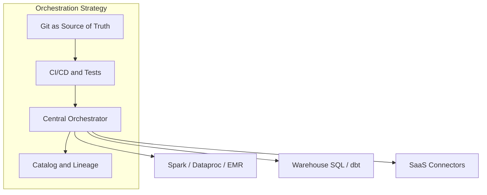

# Orchestration Strategy

## Problem Statement

Enterprise data platforms run hundreds of interdependent batch and micro-batch pipelines. Without a deliberate orchestration strategy, teams suffer from **fragile cron chains**, **opaque failures**, **missed SLAs**, and **tool sprawl** (each team picking a different scheduler). A unified strategy defines how workflows are authored, scheduled, governed, and observed — while leaving room for domain autonomy and hybrid batch/stream architectures.

## Business Use Cases

- **Regulatory reporting** — Finance close DAG must complete by 06:00 with auditable run history and controlled reruns.
- **Customer analytics** — Marketing attribution depends on orders, clicks, and CRM data landing in sequence before 07:00 local.
- **ML feature pipelines** — Daily feature store refresh with backfill after training data corrections.
- **Operational data products** — Domain teams publish curated tables; consumers rely on dataset freshness SLAs.
- **Cost optimization** — Shift heavy Spark workloads to off-peak windows via centralized scheduling and pools.

## Architecture Pattern

### Recommended pattern: **Platform orchestrator + execution specialization**

1. **Single primary orchestrator** per environment (avoid five schedulers with overlapping cron).
2. **Thin DAGs** — Tasks submit work to Spark, BigQuery, dbt Cloud, or Fivetran; no heavy logic in operators.
3. **Data-aware dependencies** where supported (Airflow Datasets, Dagster assets) instead of time-only gaps.
4. **Federated ownership** — Domains own DAG repos; platform owns runtime, RBAC, and standards.
5. **Hybrid with streaming** — Continuous paths on Kafka/Flink; orchestrator handles reconciliation, backfill, and daily aggregates.

## Technology Options

| Tier | Options | Notes |
| --- | --- | --- |
| **Open source** | Apache Airflow, Prefect, Dagster, Luigi (legacy) | Airflow: largest ecosystem; Dagster: asset-centric; Prefect: Python-native dynamic flows |
| **Commercial managed** | Astronomer, Prefect Cloud, Dagster Cloud | Reduced Day-2 ops |
| **Cloud native** | AWS Step Functions + MWAA, GCP Cloud Composer / Workflows, Azure Data Factory | IAM-native; Composer = managed Airflow |
| **Legacy enterprise** | Control-M, Autosys, Tidal | Often coexist during migration; integrate via operators/API |

## Cloud Native Options

| Capability | AWS | Azure | GCP |
| --- | --- | --- | --- |
| Managed Airflow | **MWAA** (Managed Workflows for Apache Airflow) | — (self-host or partner) | **Cloud Composer** |
| Serverless workflow | **Step Functions** | **Logic Apps** | **Cloud Workflows** |
| Data factory orchestration | **Glue Workflows** | **Azure Data Factory** | **Cloud Data Fusion** (limited) |
| Event trigger | EventBridge | Event Grid | Eventarc / Pub/Sub |
| Metadata / lineage | Glue Catalog, OpenLineage | Purview | Dataplex, Data Catalog |

## Cloud Native Matrix

| Feature / Cloud | AWS | Azure | GCP |
| --- | --- | --- | --- |
| Managed Airflow | MWAA | Partner / self-host | Cloud Composer 2 |
| Native DAG authoring | Step Functions ASL | ADF pipelines | Workflows YAML |
| Kubernetes executor | MWAA + EKS tasks | AKS + self Airflow | Composer GKE-backed |
| Integrated IAM | Strong | Strong | Strong |
| Cost model | MWAA + worker + job compute | ADF activity-based | Composer + GKE + job compute |

## Top 10 Open Source Options

Ranked learning guides: [02.03.03 Top 10 Open Source Orchestration](../../02.03.03_Top_10/README.md).

1. **Apache Airflow** — De facto OSS DAG standard; largest operator ecosystem
2. **Prefect** — Dynamic Python workflows; hybrid self-hosted workers
3. **Dagster** — Asset-oriented orchestration and built-in lineage
4. **Temporal** — Durable execution for long-running, failure-prone coordination
5. **Argo Workflows** — CNCF Kubernetes-native container batch
6. **Kestra** — Declarative YAML flows with plugin ecosystem
7. **Flyte** — Typed data/ML pipelines on Kubernetes
8. **Luigi** — Lightweight Python batch (legacy/simple estates)
9. **Metaflow** — Netflix ML/data workflow framework
10. **Mage** — Notebook-style blocks with production scheduling

**Managed cloud orchestrators** (Composer, MWAA, ADF, Step Functions, Cloud Workflows) are documented in [02.03.02 Cloud Services](../../02.03.02_Cloud_Services/README.md) — not duplicated in the Top 10 list.

## Comparison Matrix

| Feature | Airflow / Composer / MWAA | Dagster | Prefect | Step Functions |
| --- | --- | --- | --- | --- |
| DAG model | Task graph | Software-defined assets | Flows / tasks | State machine |
| Dynamic workflows | Via TaskFlow / dynamic mapping | Native partitions | Native | Limited (Map state) |
| Lineage / data awareness | Datasets (2.4+); OpenLineage plugins | First-class assets | Metadata API | Minimal |
| Self-host complexity | Medium–high | Medium | Medium | None (serverless) |
| Max task duration | Hours–days (worker bound) | Hours–days | Hours–days | 1 year (standard) |
| Community / hiring | Largest | Growing | Growing | AWS-specific |

## Operational Complexity

| Approach | Day-2 burden | Notes |
| --- | --- | --- |
| Self-hosted Airflow | High | Upgrade scheduler, DB, workers, DAG parsing issues |
| MWAA / Composer | Medium | Google/AWS patch runtime; tune workers and scaling |
| Dagster / Prefect Cloud | Low–medium | Vendor manages control plane |
| Step Functions | Low | Per-state billing; complex DAGs get verbose |

## Implementation Effort

| Phase | Duration (typical) | Activities |
| --- | --- | --- |
| Foundation | 4–8 weeks | Choose platform, HA metadata DB, RBAC, dev/prod environments |
| Migration wave 1 | 8–12 weeks | Move critical cron to DAGs; standard operators; alerting |
| DataOps integration | 4–8 weeks | CI deploy, pytest DAG integrity, staging runs |
| Advanced | Ongoing | Dataset triggers, cost pools, active metadata, federated domains |

Skills: Python, SQL, cloud IAM, Git, basic distributed systems debugging.

## Enterprise Readiness

- **SLAs** — Define freshness and completion SLOs per DAG tier ([SLA Management](../02.03.01.03_Core_Concepts/02.03.01.03.04_SLA_Management.md)).
- **DR** — Metadata DB backup; multi-AZ workers; document RTO for scheduler failover.
- **Audit** — Immutable run logs; who triggered backfill; connection access reviews.
- **Support** — Prefer managed offerings when internal Airflow expertise is limited.

## AI Readiness

- Orchestrators trigger **feature pipelines**, **batch inference**, and **evaluation jobs**.
- **LLM-assisted authoring** (Copilot for DAG code) requires linting and CI validation — do not bypass review.
- **Agentic workflows** may call tools via API tasks; keep human approval gates for prod mutations.

## Agentic Readiness

| Capability | Airflow / Dagster | Step Functions |
| --- | --- | --- |
| Dynamic tool invocation | Custom operators / ops | Lambda task |
| Human-in-the-loop | Sensors / deferrable operators | Callback patterns |
| Long-running autonomy | Not primary design center | Durable execution |

Use general workflow engines (Temporal) when autonomous agents orchestrate non-data side effects at scale.

## Recommendation

**Default:** Managed **Airflow** (Composer or MWAA) or **Dagster** for greenfield asset-centric platforms, with **Git + CI/CD**, **OpenLineage**, and **dataset-aware triggers** where available.

**Avoid:** Proliferating independent cron servers per team. **Consolidate** on one primary orchestrator per environment; integrate legacy schedulers through migration.

## Best Option by Scenario

- **GCP-native, existing Airflow skills** — Cloud Composer 2 + Dataproc/BigQuery operators
- **AWS-native, minimal ops** — MWAA for batch DAGs; Step Functions for short Lambda chains
- **Greenfield, lineage-first** — Dagster with asset checks and partitioned backfills
- **Python-heavy, dynamic ML pipelines** — Prefect 2.x with hybrid workers
- **Azure-centric ETL** — ADF as primary; Airflow for complex custom logic if needed
- **Strict serverless, low volume** — Step Functions + EventBridge

## ADR Reference

Document decisions for: primary orchestrator, self-host vs managed, executor type (K8s vs Celery), metadata DB, and migration from legacy schedulers. Link from [Orchestration Governance](../02.03.01.04_Governance/02.03.01.04.01_Orchestration_Governance.md).

## Related

- [What Is Data Orchestration](../02.03.01.01_Overview/02.03.01.01.01_What_Is_Data_Orchestration.md)
- [Orchestration Reference Model](../02.03.01.01_Overview/02.03.01.01.03_Orchestration_Reference_Model.md)
- [DataOps Framework](../02.03.01.05_DataOps/02.03.01.05.01_DataOps_Framework.md)
- [Managed Workflows](../../02.03.02_Cloud_Services/02.03.02.01_Overview/02.03.02.01.02_Managed_Workflows.md)
