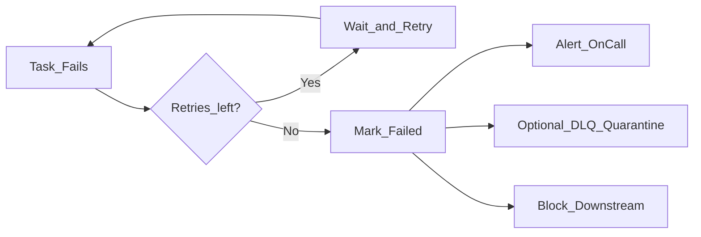

# Retry Strategies

Retries recover **transient failures** (network blips, warehouse slot contention, API rate limits) without manual intervention. Without idempotent task design, retries cause **duplicate data** or **double side effects**.

## Failure taxonomy

| Class | Examples | Retry? |
| --- | --- | --- |
| **Transient** | Timeout, 503, throttling, cluster spot loss | Yes — with backoff |
| **Permanent** | SQL syntax error, schema mismatch, auth denied | No — fail fast after minimal attempts |
| **Data quality** | Null rate exceeds threshold, reconciliation fail | No — route to quarantine branch |
| **Infrastructure** | Worker OOM, disk full | Yes — may need resource tuning |

Classify operators by failure type in runbooks.

## Retry configuration parameters

| Parameter | Purpose | Typical value |
| --- | --- | --- |
| `retries` | Max retry attempts after first failure | 2–5 for network tasks; 0 for DDL |
| `retry_delay` | Wait before first retry | 1–5 minutes |
| `retry_exponential_backoff` | Increase delay between attempts | `True` for API calls |
| `max_retry_delay` | Cap backoff | 30–60 minutes |
| `execution_timeout` | Kill hung task | Set per task SLA slice |

```python
# Conceptual Airflow default_args
default_args = {
    "retries": 3,
    "retry_delay": timedelta(minutes=5),
    "retry_exponential_backoff": True,
    "max_retry_delay": timedelta(minutes=30),
}
```

## Backoff strategies

| Strategy | Behavior | Best for |
| --- | --- | --- |
| **Fixed delay** | Same wait each retry | Quick recovery jobs |
| **Exponential backoff** | delay × 2^n | Cloud APIs, rate limits |
| **Jitter** | Randomize delay | Prevent synchronized retry storms |
| **Circuit breaker** | Stop retries after cluster-wide failures | Upstream outage |

Add **jitter** when many tasks retry the same external service simultaneously.

## Idempotency requirements

Retries are safe only when re-execution produces the same outcome:

| Pattern | Idempotent approach |
| --- | --- |
| **Partition overwrite** | `INSERT OVERWRITE` or replace partition for `ds` |
| **Merge / upsert** | Merge on natural key |
| **Append with dedup** | Write staging then merge; dedupe on job run id |
| **External side effect** | Use idempotency keys (payment API, ticket creation) |

**Non-idempotent:** Sending email alert on every retry without dedup key — use "alert once on final failure" pattern.

## Task-level vs DAG-level policy

| Level | Control | Example |
| --- | --- | --- |
| **Global default_args** | Baseline for all tasks in DAG | retries=3 |
| **Per-operator override** | DDL: retries=0; extract: retries=5 | |
| **Pool / priority** | Retry deprioritized vs fresh runs | Lower priority queue on retry |

## Dead-letter and escalation

After retries exhaust:



| Action | Purpose |
| --- | --- |
| **PagerDuty / Slack** | Notify owner with DAG, task, log link, `run_id` |
| **Dead-letter dataset** | Quarantine bad records for analysis |
| **Incident ticket** | Auto-create with severity by DAG tier |
| **Manual clear** | Operator fixes root cause; clears task for rerun |

Do not infinite-retry permanent failures — wastes resources and hides defects.

## Partial DAG retry

| Operation | Effect |
| --- | --- |
| **Clear failed task** | Rerun task and downstream only |
| **Mark success (careful)** | Skip task — audit-only exception |
| **Backfill range** | Reprocess historical partitions after fix |

Always record **who** triggered manual reruns for compliance.

## Orchestrator-specific notes

| Platform | Retry model |
| --- | --- |
| **Airflow** | Task instance retries; scheduler reschedules |
| **Prefect** | Task retry policies on flows |
| **Dagster** | Retry policies on ops; step failure handling |
| **Step Functions** | Built-in retry with catch states |

## Testing retries

- **Integration tests** — Mock transient failure (fail first N times).
- **Chaos** — Kill worker mid-task; verify at-least-once + idempotent sink.
- **Load test** — Retry storm does not overwhelm API quotas.

## Related

- [Dependency Management](02.03.01.03.02_Dependency_Management.md)
- [SLA Management](02.03.01.03.04_SLA_Management.md)
- [Orchestration Governance](../02.03.01.04_Governance/02.03.01.04.01_Orchestration_Governance.md)
- [Data Testing Strategy](../../02.03.04_Architecture_Patterns/02.03.04.01_DataOps_Patterns/02.03.04.01.05_Data_Testing_Strategy.md)
