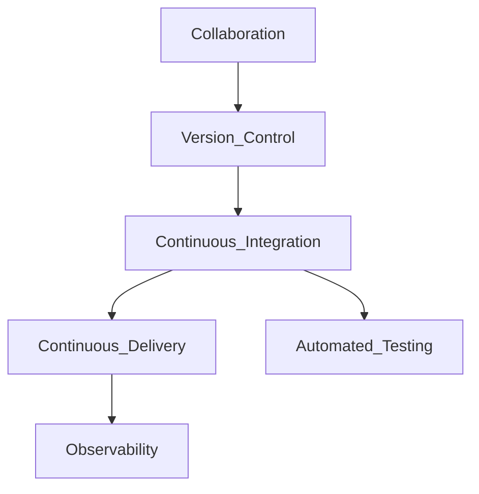

# DataOps Framework

**DataOps** applies DevOps principles — continuous integration, automated testing, version control, and collaborative delivery — to data pipelines orchestrated on shared platforms. The orchestrator is the **deployment target**; DataOps is the **delivery system** for reliable pipeline code.

## Core pillars

| Pillar | Orchestration application |
| --- | --- |
| **Version control** | DAGs, SQL, dbt models in Git — single source of truth |
| **CI** | Parse DAGs, lint, unit test, secret scan on every PR |
| **CD** | Git-sync or API deploy to dev → staging → prod orchestrator |
| **Testing** | Staging runs, data quality checks, regression on sample partitions |
| **Observability** | Run metrics, lineage, SLA dashboards tied to deploy version |
| **Collaboration** | PR reviews, shared standards, catalog-linked ownership |

## Pipeline-as-code lifecycle

| Stage | Activities | Orchestrator touchpoint |
| --- | --- | --- |
| **Develop** | Local parse; unit tests with `DagBag` | LocalExecutor dry run |
| **Integrate** | CI validates bundle | No prod impact |
| **Stage** | Deploy to staging instance | Full DAG run on synthetic/recent partition |
| **Release** | Tag + prod deploy | Git SHA recorded in run metadata |
| **Operate** | Monitor SLAs | Alert on failure; link to deploy version |
| **Learn** | Postmortem, fix, redeploy | Backfill if needed |

## CI pipeline checklist

| Check | Tooling examples | Blocks merge? |
| --- | --- | --- |
| DAG import / no cycles | `airflow dags list`, Dagster defs load | Yes |
| Lint (Python/YAML) | Ruff, pylint, yamllint | Yes |
| Unit tests | pytest on task callables | Yes for T0/T1 |
| Secret detection | gitleaks, trufflehog | Yes |
| Dependency scan | pip-audit | Warn / block by policy |
| Docs / metadata tags | Custom linter | Yes |

## CD patterns for orchestrators

| Pattern | Description | Fit |
| --- | --- | --- |
| **Git-sync sidecar** | Worker pulls branch on interval | MWAA, self-hosted K8s |
| **CI push bundle** | Pipeline uploads DAG zip to object storage | Composer, MWAA |
| **API register** | CI calls orchestrator REST to update | Prefect Cloud, Dagster Cloud |
| **Immutable artifact** | Versioned wheel/container with DAGs | Strong audit |

**Never** edit prod DAGs only in UI without Git reconciliation.

## Testing pyramid for orchestrated pipelines

| Level | Scope | Example |
| --- | --- | --- |
| **Unit** | Task function logic | Mock DB; assert transform output |
| **DAG integrity** | Graph structure | No cycles; required tags present |
| **Integration** | Staging run end-to-end | Yesterday's partition in staging warehouse |
| **Data quality** | Post-task checks | dbt tests, Great Expectations |
| **Production monitor** | SLI / anomaly | Row count drift, freshness miss |

## Environment promotion

| Environment | Data | Schedule | Connections |
| --- | --- | --- | --- |
| **Dev** | Synthetic / sampled | Manual or frequent | Dev warehouse |
| **Staging** | Prod-like subset | Mirror prod timing (scaled) | Staging roles |
| **Prod** | Full | Business schedules | Prod roles |

Promote **identical code**; differ only configuration (Variables, Connections, `env` param).

## Rollback strategy

1. **Revert Git commit** and redeploy previous artifact (preferred).
2. **Pause DAG** if bad deploy causes damage (`is_paused=True`).
3. **Backfill** affected partitions after fix deployed.
4. **Document** incident with deploy SHA correlation.

## DataOps vs MLOps overlap

| Concern | DataOps | MLOps |
| --- | --- | --- |
| Batch feature pipelines | Orchestrator DAG | Same |
| Model training jobs | Scheduled training DAG | Experiment tracking |
| Model deployment | Optional orchestration trigger | CI/CD to serving |

Use one orchestration platform where possible; share CI libraries.

## Related

- [DataOps Maturity Model](02.03.01.05.02_DataOps_Maturity_Model.md)
- [Enterprise DataOps Playbook](02.03.01.05.03_Enterprise_DataOps_Playbook.md)
- [CI/CD For Data](../../02.03.04_Architecture_Patterns/02.03.04.01_DataOps_Patterns/02.03.04.01.01_CI_CD_For_Data.md)
- [Orchestration Governance](../02.03.01.04_Governance/02.03.01.04.01_Orchestration_Governance.md)
