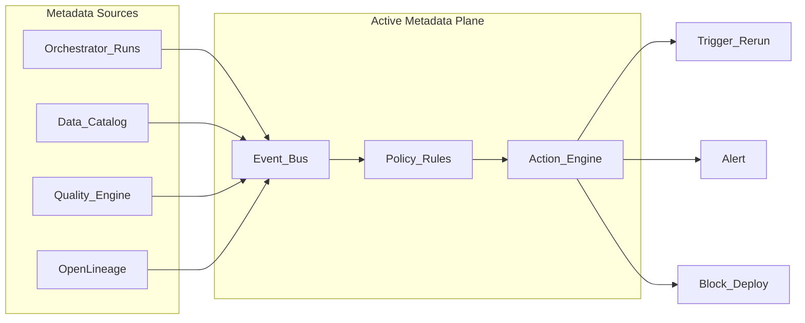

# Active Metadata

**Active metadata** is metadata that **triggers automated actions** — not merely documented in a catalog. In orchestration, active metadata closes the loop between **what the catalog knows** (freshness, schema, lineage, quality scores) and **what the orchestrator does** (run, pause, alert, scale, quarantine).

Passive metadata answers questions. Active metadata **changes system behavior**.

## Passive vs active metadata

| Aspect | Passive | Active |
| --- | --- | --- |
| **Freshness** | "Last updated 8 hours ago" displayed | Breach triggers downstream DAG pause + PagerDuty |
| **Schema change** | Column documented | Drift detected → block prod promote + open ticket |
| **Lineage** | Static graph UI | Impact analysis auto-notifies all downstream owners |
| **Quality score** | Dashboard metric | Score < threshold → quarantine partition task in DAG |
| **Cost** | Monthly report | Anomaly → throttle pool slots for non-T0 DAGs |

## Architecture

## Event types driving orchestration

| Event | Source | Orchestration action |
| --- | --- | --- |
| `dataset.updated` | Catalog / OpenLineage | Trigger downstream DAG (dataset schedule) |
| `freshness.sla_breach` | SLA monitor | Page owner; optional auto-clear blocked runs |
| `schema.breaking_change` | Schema registry | Fail CI deploy; pause consumer DAGs |
| `quality.check_failed` | GE / dbt / custom | Branch to quarantine; skip publish task |
| `cost.anomaly` | FinOps export | Reduce pool concurrency |
| `run.failed` | Orchestrator | Enrich incident with lineage blast radius |

## Integration patterns

### 1. Dataset-triggered DAGs (declarative)

Orchestrator natively schedules when catalog URI updates (Airflow Datasets, Dagster assets). This is the **simplest** active metadata pattern.

### 2. Event bus (programmatic)

Catalog or observability platform publishes to Kafka/Pub/Sub/EventBridge; lambda/worker calls orchestrator REST API to trigger or pause DAGs.

### 3. Policy engine (governance)

OPA / custom rules evaluate metadata on deploy: "T0 DAG cannot depend on dataset without SLA registered."

### 4. Closed-loop quality

Quality task writes result to metadata store → rule engine triggers rerun or blocks gold layer promotion.

## Metadata required for activation

| Field | Used for |
| --- | --- |
| Dataset URI / FQN | Trigger matching |
| Owner / on-call | Routing actions |
| SLA tier + deadline | Breach detection |
| Schema version | Drift policies |
| Upstream / downstream lineage | Impact notifications |
| Orchestrator ids (`dag_id`, asset key) | API targets |

Enforce via [Orchestration Governance](../02.03.01.04_Governance/02.03.01.04.01_Orchestration_Governance.md) CI checks.

## Implementation roadmap

| Stage | Capability |
| --- | --- |
| **1** | OpenLineage from all prod tasks → catalog |
| **2** | Freshness SLIs in catalog synced from orchestrator run end times |
| **3** | Dataset-triggered schedules replace top 20 sensors |
| **4** | Automated actions on schema/quality events with audit log |
| **5** | Self-healing: auto-backfill on verified idempotent failures ( guarded ) |

Start with **read-only enrichment** (lineage on failure) before **write actions** (auto-trigger prod).

## Safety guardrails

- **Human approval** for prod backfills triggered by rules (except predefined T2/T3 patterns).
- **Idempotency check** before auto-rerun.
- **Rate limits** on action engine — prevent trigger storms.
- **Audit trail** — every action logs rule id, input event, actor (system/user).
- **Dry-run mode** for new rules in staging.

## Technology landscape

| Capability | Examples |
| --- | --- |
| Catalog + events | DataHub actions, Alation, Collibra workflows |
| Lineage | OpenLineage, Marquez, Dataplex |
| Orchestrator native | Airflow Datasets, Dagster automation conditions |
| Quality | Great Expectations Cloud, Soda, dbt tests → webhooks |
| Generic automation | EventBridge + Lambda, Cloud Functions, Prefect automations |

## Relationship to metadata-driven engineering

Active metadata is the **runtime nervous system**; [metadata-driven pipelines](../../02.03.04_Architecture_Patterns/02.03.04.02_Metadata_Driven/02.03.04.02.01_Metadata_Driven_Framework.md) are the **generation blueprint**. Together:

- **Define** pipelines from metadata (config-driven).
- **Operate** pipelines via metadata events (active metadata).

See also [Metadata Orchestration](../../02.03.04_Architecture_Patterns/02.03.04.02_Metadata_Driven/02.03.04.02.07_Metadata_Orchestration.md).

## Related

- [Scheduling Patterns](../02.03.01.03_Core_Concepts/02.03.01.03.01_Scheduling_Patterns.md)
- [Dependency Management](../02.03.01.03_Core_Concepts/02.03.01.03.02_Dependency_Management.md)
- [Metadata Reference Architecture](../../02.03.09_Reference_Architectures/02.03.09.01_Metadata_Reference_Architecture.md)
- [AI Metadata Management](../../02.03.04_Architecture_Patterns/02.03.04.04_AI_Assisted/02.03.04.04.07_AI_Metadata_Management.md)
