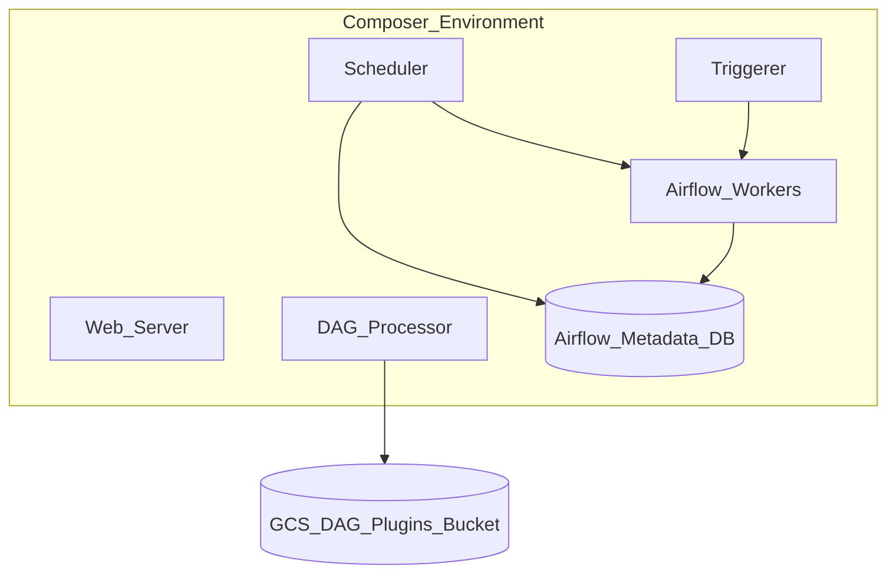
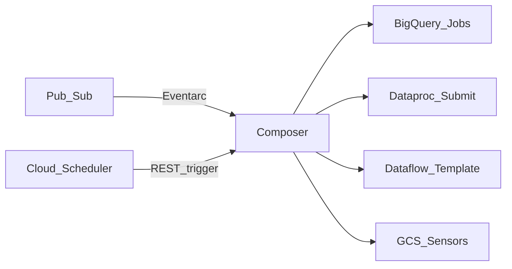

# 2. Architecture of Cloud Composer

## Control plane vs data plane

| Plane | Responsibility |
| --- | --- |
| **Control plane (Google-managed)** | Composer environment lifecycle, GKE cluster, Airflow metadata DB, scheduler/triggerer HA, upgrades, monitoring agents |
| **Data plane (your workloads)** | DAG parsing, task execution on workers, remote calls to BigQuery/Dataproc/APIs, logs emitted to Cloud Logging |

You do not SSH into Airflow workers in normal operations. Scaling and patching are managed; you tune **worker bounds**, **environment size**, and **DAG design**.

## Environment components (Composer 3)



| Component | Role |
| --- | --- |
| **Scheduler** | Creates DAG runs; enqueues task instances |
| **DAG processor** | Parses DAG files from GCS; detects changes |
| **Triggerer** | Runs deferrable operators / async triggers (Airflow 2.2+) |
| **Workers** | Execute task processes (Celery/K8s executor model) |
| **Web server** | UI and REST API |
| **Metadata DB** | PostgreSQL (managed) — DAG runs, task state, variables, connections |
| **GCS bucket** | `dags/`, `plugins/`, `data/`, logs (config-dependent) |

## Executor model

Composer environments use a **distributed executor** pattern (Celery with Kubernetes-backed workers in modern Composer). Tasks are **queued** centrally and **executed on workers** until success/failure/retry.

Implications:

- Worker count caps **parallel task** capacity.
- Long-running tasks **hold worker slots** — use deferrable operators or offload to Dataproc/BQ jobs.
- **Pools** limit concurrency per resource (e.g., BigQuery slots).

## Scaling dimensions

| Dimension | Mechanism |
| --- | --- |
| **Horizontal (workers)** | Autoscaling between `min` and `max` workers based on queue depth |
| **Vertical (worker size)** | CPU/memory per worker — larger tasks need bigger workers |
| **Environment size** | Small/Medium/Large presets affect scheduler, DB throughput, DAG processor capacity |
| **Scheduler count** | HA schedulers in larger configs |

See [Production Configuration](02.03.02.02.03.07_Production_Configuration.md) for tuning recipes.

## DAG deployment architecture

```
Git (source of truth) → CI (test DagBag) → gsutil/Terraform → gs://ENV-bucket/dags/
                                                      → plugins.zip, requirements.txt
```

**Anti-pattern:** Editing DAGs only in GCS without Git — breaks audit and CI.

## Network architecture

| Mode | Use |
| --- | --- |
| **Public IP** | Dev only |
| **Private IP** | Production — nodes have private RFC1918 addresses |
| **Private Service Connect / VPC peering** | Reach BigQuery, Dataproc, on-prem via hybrid connectivity |
| **VPC Service Controls** | Data exfiltration boundary for regulated workloads |

Workers need egress to Google APIs and your data plane (BigQuery, GCS, private Dataproc).

## Security architecture

- **IAM:** Environment service account runs workers; scope `roles/composer.worker` + data roles (e.g., `bigquery.jobUser`).
- **Secret Manager:** Store connection passwords and API keys; reference in Airflow connections.
- **User access:** IAP or VPN to private web UI; RBAC via Google accounts + Airflow roles where configured.
- **CMEK:** Optional customer-managed keys for environment storage.

## Integration topology (typical data platform)



## High availability and DR

- Google manages **multi-zone** control infrastructure within a region.
- **Metadata DB** backups — understand RPO/RTO in [Composer docs](https://cloud.google.com/composer/docs/composer-3/disaster-recovery).
- **DR pattern:** Secondary Composer environment in another region + DAG/object replication; failover is **not automatic** — runbook required.

## Related

- [Overview](02.03.02.02.03.01_Overview.md)
- [How to Use](02.03.02.02.03.03_How_To_Use.md)
- [Environment architecture (official)](https://cloud.google.com/composer/docs/composer-3/environment-architecture)
