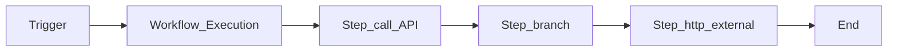

# 1. Cloud Workflows Overview

## What is Google Cloud Workflows?

**Cloud Workflows** is a **fully managed, serverless orchestration** service that executes workflows defined in **YAML** (or JSON). Each workflow is a state machine of **steps** — assign variables, call HTTP endpoints, invoke Google Cloud APIs, branch, loop, parallelize, and wait for callbacks.

You pay **only when steps run**. There is **no charge while idle** — no workers, clusters, or control-plane hours.

## Mental model

- **Workflow** = deployed definition (versioned).
- **Execution** = one run with input JSON and full audit history.
- **Step** = billable unit (including retries).

## When to use Workflows

| Use Workflows when… | Consider Composer when… |
| --- | --- |
| Chain **&lt; 20–30 steps** across APIs | **100+ task** DAG with complex dependencies |
| **Event-driven** glue (file landed, webhook) | Daily **cron batch** with backfill |
| **Serverless** cost model (sparse runs) | Need **Airflow UI**, pools, datasets |
| **HTTP / GCP API** orchestration | Heavy **Python** transform logic in orchestrator |
| Human **callback** approval patterns | OpenLineage-native batch platform |

## Workflows vs Composer vs Cloud Scheduler

| Service | Role |
| --- | --- |
| **Cloud Scheduler** | Cron trigger only — fires HTTP/Pub/Sub |
| **Cloud Workflows** | Multi-step logic, retries, branching |
| **Cloud Composer** | Full Airflow DAG platform |

Typical stack: **Scheduler → Workflows → BigQuery/Run/Functions** for lightweight pipelines; **Composer** for enterprise batch DAGs.

## Key capabilities

- Up to **1 year** execution duration (with callback/wait steps)
- **Try/retry** with exponential backoff in definition
- **Parallel** branches and **for** loops
- **Subworkflows** for reuse
- **Connectors** for Google Cloud APIs (BigQuery, GCS, Pub/Sub, etc.)
- **Eventarc** integration (GCS, Pub/Sub, Audit Logs)
- **Execution backlogging** when concurrency quota full
- IAM with `workflows.invoker` and per-workflow SA

## Learning path

Continue to [Architecture](02.03.02.02.04.02_Architecture.md) or [Scenarios](02.03.02.02.04.04_Scenarios.md).

## Related

- [Cloud Workflows Architecture](../02.03.02.02.02_Cloud_Workflows_Architecture.md)
- [Cloud Composer Learning Guide](../02.03.02.02.03_Cloud_Composer_Learning_Guide/README.md)
- [Official docs](https://cloud.google.com/workflows/docs)
