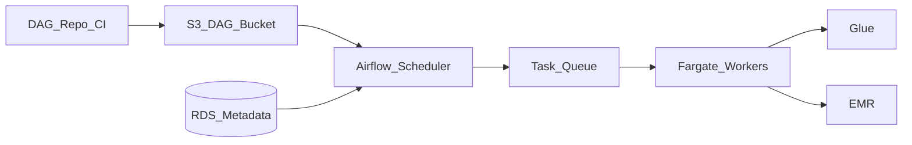

# 1. Amazon MWAA Overview

## What is MWAA?

**Amazon Managed Workflows for Apache Airflow (MWAA)** is AWS's **managed Apache Airflow** service. AWS operates the Airflow scheduler, web server, workers, and metadata database (RDS) inside your VPC. You author **DAGs in Python**, store them in S3, and use Airflow operators to orchestrate Glue, EMR, Redshift, Athena, Lambda, and hundreds of other systems.

MWAA is the **default AWS control plane** for enterprise batch data pipelines when teams need DAG dependencies, backfills, SLAs, and portable Airflow code.

## Mental model

- **You own** DAG code, connections, variables, plugins, and runbooks.
- **AWS owns** patching, scheduler/webserver infrastructure, and worker scaling on Fargate.
- **Execution engines** (Glue Spark, EMR, Redshift) run **outside** the worker for heavy compute.

## Environment classes

| Class | Typical use | Baseline capacity |
| --- | --- | --- |
| **mw1.micro** | Sandbox / very small | Up to ~25 DAGs |
| **mw1.small** | Dev / low volume | Up to ~50 DAGs |
| **mw1.medium** | Production moderate | Up to ~250 DAGs |
| **mw1.large** | High concurrency | Up to ~1,000 DAGs |
| **mw1.xlarge / 2xlarge** | Enterprise platform | 2,000+ DAGs |

Verify current [environment class limits](https://docs.aws.amazon.com/mwaa/latest/userguide/environment-class.html) before sizing.

## When to use MWAA

| Use MWAA when… | Consider alternatives when… |
| --- | --- |
| You need multi-step **DAGs** with dependencies and backfills | Workflow is &lt; 10 API steps with no DAG graph |
| Team has **Airflow** skills or portable DAG investment | Zero idle cost for sparse runs → **Step Functions** |
| Orchestrating **Glue + EMR + Redshift + S3** daily batch | Pure S3 event reaction → **Step Functions + EventBridge** |
| **OpenLineage**, pools, SLA sensors required | Glue-only ETL inside catalog → **Glue Workflows** |
| Hundreds of pipelines need **central governance** | One cron Lambda job may suffice |

## MWAA vs Step Functions vs self-hosted Airflow

| Style | AWS service | Character |
| --- | --- | --- |
| **Managed batch DAG platform** | MWAA | Python DAGs, backfill, Airflow UI |
| **Serverless state machine** | Step Functions | ASL JSON/YAML, per-transition billing |
| **DIY control** | Airflow on EKS / EC2 | Full config; you operate upgrades |

See [Step Functions Learning Guide](../02.03.02.03.05_Step_Functions_Learning_Guide/README.md) for complementary serverless patterns.

## Key capabilities at a glance

- Autoscaling **workers** (min/max bounds on Fargate)
- **Private webserver** mode (VPN/Direct Connect access)
- **Secrets Manager** backend for Airflow connections
- **S3** DAG sync; CI/CD deploy patterns
- **Scheduler scaling** (multiple schedulers on larger classes)
- **Airflow 2.x** features: TaskFlow API, datasets, deferrable operators, dynamic task mapping
- Integration with **CloudWatch**, **EventBridge**, **X-Ray**

## Learning path

Continue to [Architecture](02.03.02.03.04.02_Architecture.md) for component design, or [Scenarios](02.03.02.03.04.04_Scenarios.md) for enterprise pipeline patterns.

## Related

- [MWAA Architecture](../02.03.02.03.01_MWAA_Architecture.md)
- [How to Use](02.03.02.03.04.03_How_To_Use.md)
- [Official MWAA docs](https://docs.aws.amazon.com/mwaa/)
