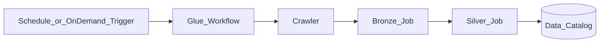

# 1. AWS Glue Workflows Overview

## What are Glue Workflows?

**AWS Glue Workflows** orchestrate **Glue-native data integration** — ETL jobs, crawlers, and triggers — as a dependency graph inside the AWS Glue service. Workflows provide run history, conditional branching on job success/failure, and **workflow run properties** to pass parameters between steps. They are the natural orchestration layer when your pipeline stays **inside Glue Studio and the Data Catalog**.

Glue Workflows is **not** a general-purpose DAG engine like Airflow. It does not natively orchestrate EMR, Redshift, or SaaS APIs — use **MWAA** or **Step Functions** for cross-service control planes.

## Mental model

- **You own** job scripts, crawler targets, trigger logic, and bookmark strategy.
- **AWS owns** Spark runtime, workflow state tracking, and Glue Studio integration.
- **Cost** is driven by **DPU-hours** for jobs and crawlers — the workflow itself has **no separate orchestration fee**.

## Core building blocks

| Building block | Role |
| --- | --- |
| **Workflow** | Named container linking jobs, crawlers, and triggers |
| **Trigger** | Schedule, on-demand, conditional (job/crawler state), or EventBridge event |
| **ETL job** | Spark (Standard/Flex), Python shell, or Ray |
| **Crawler** | Discover schema → Data Catalog |
| **Job bookmark** | Incremental processing cursor |

## When to use Glue Workflows

| Use Glue Workflows when… | Consider alternatives when… |
| --- | --- |
| Pipeline is **Glue jobs + crawlers** only | Need EMR, Redshift, Lambda, SaaS in one DAG → **MWAA** |
| Team prefers **Glue Studio** visual authoring | Portable Airflow code across clouds → **MWAA** |
| **Catalog-centric** medallion on S3/Iceberg | Event-driven multi-service chain → **Step Functions** |
| Incremental ingest with **job bookmarks** | Complex backfill across 50+ non-Glue systems |
| Cost focus on **DPU** not orchestrator idle fee | Platform-wide governance for 300+ DAGs → **MWAA** |

## Glue Workflows vs MWAA vs Step Functions

| Style | Service | Character |
| --- | --- | --- |
| **Glue-native job graph** | Glue Workflows | Studio UI, catalog lineage, DPU billing |
| **Managed batch DAG platform** | MWAA | Python DAGs, any AWS operator |
| **Serverless state machine** | Step Functions | ASL, per-transition billing, cross-service |

**Hybrid pattern:** Glue Workflows for in-Glue medallion steps; MWAA coordinates Glue + Redshift + dbt; Step Functions handles S3 event ingress.

## Key capabilities at a glance

- Schedule, on-demand, and **conditional triggers** (SUCCEEDED / FAILED / etc.)
- **EventBridge event triggers** for S3/Lake Formation events (batch/window limits apply)
- **Workflow run properties** — JSON passed between jobs
- **MaxConcurrentRuns** on workflow for cost/concurrency control
- **Job queuing** when account concurrency exceeded (up to 15 min wait)
- Integrated **run graph** in Glue Studio
- **Flex execution class** for up to ~35% DPU savings on non-urgent jobs

## Learning path

Continue to [Architecture](02.03.02.03.06.02_Architecture.md) or [Scenarios](02.03.02.03.06.04_Scenarios.md).

## Related

- [Glue Workflows Architecture](../02.03.02.03.03_Glue_Workflows_Architecture.md)
- [MWAA Learning Guide](../02.03.02.03.04_MWAA_Learning_Guide/README.md)
- [Official workflows overview](https://docs.aws.amazon.com/glue/latest/dg/workflows_overview.html)
