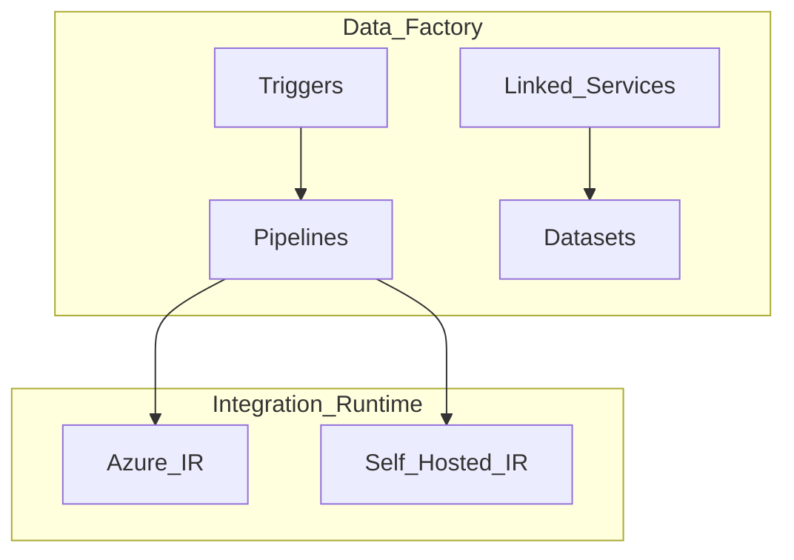
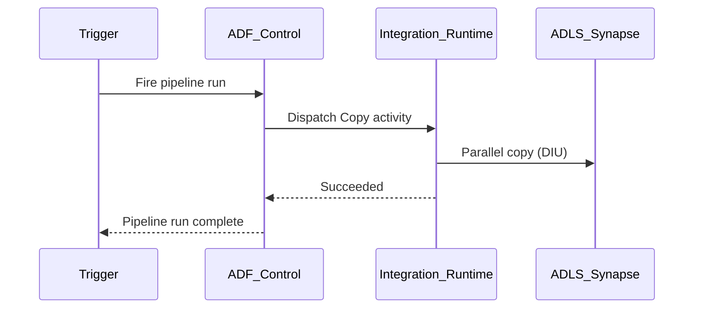

# 2. Architecture of Azure Data Factory

## Control plane vs execution plane

| Plane | Responsibility |
| --- | --- |
| **Control plane (ADF service)** | Pipeline/trigger CRUD, scheduling, monitoring API, Git sync |
| **Execution plane (IR + compute targets)** | Copy data movement, data flow Spark clusters, external compute (Databricks, Synapse) |

Orchestration meters bill for **activity runs**; data movement bills **DIU-hours**; transforms bill **vCore-hours** on mapping data flows.

## Factory topology

## Core objects

| Object | Description |
| --- | --- |
| **Factory** | Regional ADF instance — billing and Git repo anchor |
| **Pipeline** | DAG of activities with parameters |
| **Activity** | Copy, ExecuteDataFlow, SynapseNotebook, Databricks, If, ForEach, etc. |
| **Dataset** | Schema/location pointer to data |
| **Linked service** | Connection string / auth to source or sink |
| **Trigger** | Schedule, tumbling window, blob events, custom event |

## Integration Runtime types

| IR type | Use |
| --- | --- |
| **Azure IR** | Cloud-to-cloud copy; dispatch activities |
| **Self-Hosted IR** | On-premises / VNet-private sources |
| **Azure-SSIS IR** | Lift-and-shift SSIS packages |

SHIR requires **high availability** — register multiple nodes on same IR for production.

## Activity execution flow

## Control flow activities

| Activity | Purpose |
| --- | --- |
| **If Condition** | Branch on expression |
| **ForEach** | Parallel/sequential over array |
| **Until** | Loop until condition |
| **Switch** | Multi-branch |
| **Execute Pipeline** | Nested pipeline |
| **Wait / SetVariable** | Timing and state |

## Security architecture

- **Managed identity** on factory and linked services.
- **Private Link** for factory and SHIR communication.
- **Key Vault** secret references in linked services.
- **Purview** scan and lineage registration on outputs.

## Fabric alignment

Fabric Data Factory reuses pipeline concepts with workspace-scoped authoring and OneLake paths. Hybrid estates may run **ADF for legacy** and **Fabric pipelines for new** lakehouse workloads during migration.

## Related

- [Overview](02.03.02.04.03.01_Overview.md)
- [How to Use](02.03.02.04.03.03_How_To_Use.md)
- [Integration Runtime docs](https://learn.microsoft.com/en-us/azure/data-factory/concepts-integration-runtime)
