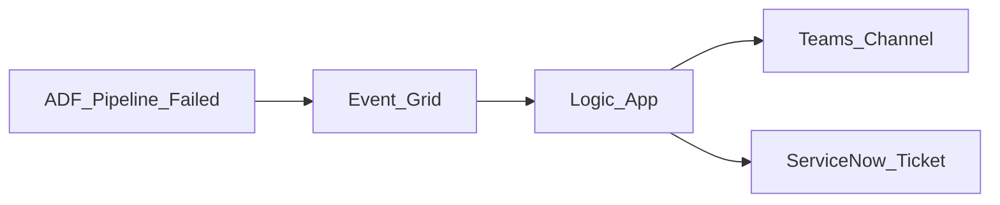

# 4. Azure Logic Apps Scenarios

## Scenario catalog

| # | Scenario | Pattern | Logic Apps role |
| ---: | --- | --- | --- |
| 1 | ADF pipeline failure alert | Event Grid → Teams | Operational notification |
| 2 | Human approval before prod | Approval action | Gate ADF ARM deploy |
| 3 | Blob landed → start ADF | Event Grid trigger | Lightweight ingress |
| 4 | ServiceNow incident on SLA miss | Connector chain | ITSM integration |
| 5 | SharePoint list → ADLS (light) | Connector + Blob | Small file pull |
| 6 | Webhook from SaaS | HTTP Request trigger | Start downstream |
| 7 | Scheduled health check | Recurrence → REST | Call Synapse query API |
| 8 | Multi-step approval chain | Condition + delay | Finance sign-off |
| 9 | Cross-subscription notify | Managed identity | RBAC-scoped calls |
| 10 | B2B EDI (Integration Account) | EDI decode | Enterprise integration |
| 11 | Cost guardrail | Parse JSON → Condition | Abort if size &gt; limit |
| 12 | Purview scan complete notify | Event Grid | Alert stewards |
| 13 | DevOps pipeline gate | Azure DevOps connector | Release orchestration |
| 14 | Duplicate event dedupe | Idempotent key in Storage | At-least-once handling |
| 15 | Hybrid ADF + Logic Apps | LA ingress, ADF batch | Platform split |

## Detailed patterns

### ADF failure alert



Subscribe to `Microsoft.DataFactory.PipeLineRun.Failed` on factory resource.

### Human approval before production

```
Approval email → Wait for approve/reject → If approved → ARM deploy ADF artifacts
```

Use **Standard** plan for long-running approval timeouts if needed.

### Blob trigger → ADF

Event Grid on `Microsoft.Storage.BlobCreated` → Logic App passes `url` parameter to ADF `createRun`.

## Scenario selection guide

| Requirement | Recommended shape |
| --- | --- |
| ELT 20+ activities | **ADF** |
| Teams alert on failure | **Logic Apps** |
| High-volume copy | **ADF** not Logic Apps |
| SaaS API without custom code | **Logic Apps** connectors |

## Related

- [ADF Scenarios](../02.03.02.04.03_Azure_Data_Factory_Learning_Guide/02.03.02.04.03.04_Scenarios.md)
- [Step Functions Scenarios](../../02.03.02.03_AWS/02.03.02.03.05_Step_Functions_Learning_Guide/02.03.02.03.05.04_Scenarios.md)
