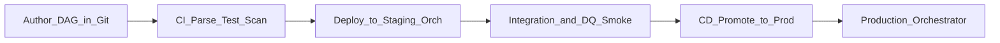

# CI/CD for Data Pipelines

## Problem

Data pipelines change as often as application code, but **bad deploys corrupt datasets** - not just uptime. Without CI/CD, orchestration becomes a manual UI sport: DAGs promoted without parse tests, secrets drift, and prod backfills run from unreviewed branches.

## Pattern

Treat orchestration definitions (DAGs, flows, assets, YAML workflows) as **versioned artifacts** in Git. CI validates; CD promotes to orchestrator environments with the same rigor as microservices.

## Pipeline stages

| Stage | Orchestration checks |
| --- | --- |
| **Lint / parse** | airflow dags test, dagster definitions validate, YAML schema |
| **Unit** | Task logic, mock connections, @task isolation |
| **Integration** | Staging run against sandbox warehouse |
| **Security** | No secrets in repo; connection IDs only |
| **Deploy** | Sync to object storage / API / Helm; pause old DAG version |

## Environment model

| Environment | Orchestrator | Data |
| --- | --- | --- |
| Dev | Local or shared dev cluster | Synthetic / sampled |
| Staging | Mirror prod topology | Anonymized prod subset |
| Prod | HA control plane | Full datasets |

## Tooling map

| Layer | Examples |
| --- | --- |
| CI | GitHub Actions, GitLab CI, Azure DevOps |
| DAG sync | Astronomer CI, MWAA S3 sync, Composer GCS, Prefect deploy |
| IaC | Terraform for MWAA/Composer/ADF linked services |
| Policy | OPA on DAG metadata before merge |

## Anti-patterns

- Deploying directly from laptop to prod orchestrator
- Skipping staging because "it's just a schedule change"
- Same connection credentials across environments

## Related

- [GitOps for Data](02.03.04.01.02_GitOps_For_Data.md)
- [Data Deployment Strategy](02.03.04.01.03_Data_Deployment_Strategy.md)
- [Orchestration Governance](../../02.03.01_Fundamentals/02.03.01.04_Governance/02.03.01.04.01_Orchestration_Governance.md)
- [Cloud Services](../../02.03.02_Cloud_Services/README.md)