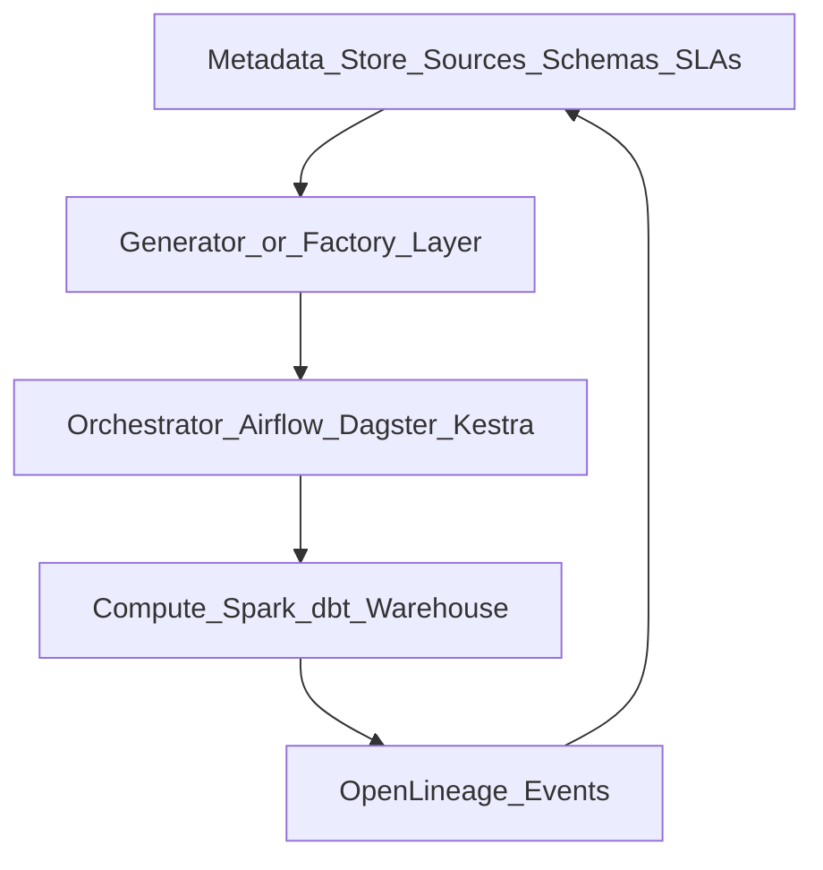

# Metadata-Driven Framework

## Problem

Hard-coded pipelines multiply: every new source means copy-paste DAGs. A **metadata-driven framework** generates or configures orchestration from **declarative metadata** (YAML, catalog tables, registry APIs).

## Reference architecture

## Core metadata entities

| Entity | Drives |
| --- | --- |
| **Source** | Ingest task template, schedule, connection |
| **Dataset** | Asset key, partitions, dependencies |
| **Transformation** | dbt model ref, SQL template params |
| **SLA** | Priority pool, alert routing |
| **Lineage edge** | Upstream/downstream in DAG |

## Framework layers

1. **Metadata model** - canonical schema (often catalog or internal DB)
2. **Template library** - Jinja/YAML/Python factory for task patterns
3. **Compiler** - emits DAGs or registers assets at deploy time
4. **Runtime adapter** - target orchestrator plugin
5. **Feedback** - run outcomes update freshness in metadata

## When to adopt

| Signal | Action |
| --- | --- |
| >50 similar pipelines | Invest in factory |
| Frequent onboardings | Self-service metadata forms |
| Multi-orchestrator estate | Metadata abstraction layer |

## Related

- [Metadata-Driven ETL](02.03.04.02.02_Metadata_Driven_ETL.md)
- [Dynamic Pipeline Generation](02.03.04.02.05_Dynamic_Pipeline_Generation.md)
- [Active Metadata](../../02.03.01_Fundamentals/02.03.01.06_Active_Metadata/02.03.01.06.01_Active_Metadata.md)
