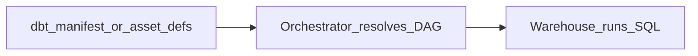

# Metadata-Driven Transformations

## Problem

Transform logic scattered across SQL files, notebooks, and DAG tasks lacks a **single contract** for inputs, outputs, and dependencies. Metadata-driven transformations bind **what changes** to **orchestration order**.

## Pattern

Transform metadata (dbt schema.yml, catalog columns, or internal registry) declares:

- Input datasets / models
- Output datasets / models
- Materialization strategy
- Tests and owners

Orchestrator **derives** run order from metadata graph - not manual >> operators.

| System | Mechanism |
| --- | --- |
| **dbt + Airflow** | Cosmos / Astronomer dbt tasks from manifest |
| **Dagster** | Assets from dbt project or @asset defs |
| **Spark** | Delta table properties → dependency sensor |

## Partition alignment

Metadata carries partition_key / incremental_strategy so orchestrator schedules **aligned backfills** across upstream and downstream transforms.

## Related

- [Metadata-Driven ETL](02.03.04.02.02_Metadata_Driven_ETL.md)
- [Dependency Management](../../02.03.01_Fundamentals/02.03.01.03_Core_Concepts/02.03.01.03.02_Dependency_Management.md)
